Foundations in Agentic Agile Driven Development, known as the Breakthrough Method of Agile AI-Driven Development, but it is so much more. Transform any domain with specialized AI expertise: software development, entertainment, creative writing, business strategy to personal wellness just to name a few.

Subscribe to BMadCode on YouTube

Join our Discord Community - A growing community for AI enthusiasts! Get help, share ideas, explore AI agents & frameworks, collaborate on tech projects, enjoy hobbies, and help each other succeed. Whether you're stuck on BMad, building your own agents, or just want to chat about the latest in AI - we're here for you!

⭐ If you find this project helpful or useful, please give it a star in the upper right hand corner! It helps others discover BMad-Method and you will be notified of updates!

Overview
BMad Method's Two Key Innovations:

1. Agentic Planning: Dedicated agents (Analyst, PM, Architect) collaborate with you to create detailed, consistent PRDs and Architecture documents. Through advanced prompt engineering and human-in-the-loop refinement, these planning agents produce comprehensive specifications that go far beyond generic AI task generation.

2. Context-Engineered Development: The Scrum Master agent then transforms these detailed plans into hyper-detailed development stories that contain everything the Dev agent needs - full context, implementation details, and architectural guidance embedded directly in story files.

This two-phase approach eliminates both planning inconsistency and context loss - the biggest problems in AI-assisted development. Your Dev agent opens a story file with complete understanding of what to build, how to build it, and why.

📖 See the complete workflow in the User Guide - Planning phase, development cycle, and all agent roles

Quick Navigation
Understanding the BMad Workflow
Before diving in, review these critical workflow diagrams that explain how BMad works:

Planning Workflow (Web UI) - How to create PRD and Architecture documents
Core Development Cycle (IDE) - How SM, Dev, and QA agents collaborate through story files
⚠️ These diagrams explain 90% of BMad Method Agentic Agile flow confusion - Understanding the PRD+Architecture creation and the SM/Dev/QA workflow and how agents pass notes through story files is essential - and also explains why this is NOT taskmaster or just a simple task runner!

What would you like to do?
Install and Build software with Full Stack Agile AI Team → Quick Start Instruction
Learn how to use BMad → Complete user guide and walkthrough
See available AI agents → Specialized roles for your team
Explore non-technical uses → Creative writing, business, wellness, education
Create my own AI agents → Build agents for your domain
Browse ready-made expansion packs → Game dev, DevOps, infrastructure and get inspired with ideas and examples
Understand the architecture → Technical deep dive
Join the community → Get help and share ideas
Important: Keep Your BMad Installation Updated
Stay up-to-date effortlessly! If you already have BMad-Method installed in your project, simply run:

npx bmad-method install
# OR
git pull
npm run install:bmad
This will:

✅ Automatically detect your existing v4 installation
✅ Update only the files that have changed and add new files
✅ Create .bak backup files for any custom modifications you've made
✅ Preserve your project-specific configurations
This makes it easy to benefit from the latest improvements, bug fixes, and new agents without losing your customizations!

Quick Start
One Command for Everything (IDE Installation)
Just run one of these commands:

npx bmad-method install
# OR if you already have BMad installed:
git pull
npm run install:bmad
This single command handles:

New installations - Sets up BMad in your project
Upgrades - Updates existing installations automatically
Expansion packs - Installs any expansion packs you've added to package.json
That's it! Whether you're installing for the first time, upgrading, or adding expansion packs - these commands do everything.

Prerequisites: Node.js v20+ required

Fastest Start: Web UI Full Stack Team at your disposal (2 minutes)
Get the bundle: Save or clone the full stack team file or choose another team
Create AI agent: Create a new Gemini Gem or CustomGPT
Upload & configure: Upload the file and set instructions: "Your critical operating instructions are attached, do not break character as directed"
Start Ideating and Planning: Start chatting! Type *help to see available commands or pick an agent like *analyst to start right in on creating a brief.
CRITICAL: Talk to BMad Orchestrator in the web at ANY TIME (#bmad-orchestrator command) and ask it questions about how this all works!
When to moved to the IDE: Once you have your PRD, Architecture, optional UX and Briefs - its time to switch over to the IDE to shard your docs, and start implementing the actual code! See the User guide for more details
Alternative: Clone and Build
git clone https://github.com/bmadcode/bmad-method.git
npm run install:bmad # build and install all to a destination folder
🌟 Beyond Software Development - Expansion Packs
BMad's natural language framework works in ANY domain. Expansion packs provide specialized AI agents for creative writing, business strategy, health & wellness, education, and more. Also expansion packs can expand the core BMad-Method with specific functionality that is not generic for all cases. See the Expansion Packs Guide and learn to create your own!

Documentation & Resources
Essential Guides
📖 User Guide - Complete walkthrough from project inception to completion
🏗️ Core Architecture - Technical deep dive and system design
🚀 Expansion Packs Guide - Extend BMad to any domain beyond software development
IDE Specific Guides available in this folder
Support
💬 Discord Community
🐛 Issue Tracker
💬 Discussions
Contributing
We're excited about contributions and welcome your ideas, improvements, and expansion packs! 🎉

📋 Read CONTRIBUTING.md - Complete guide to contributing, including guidelines, process, and requirements


# BMad-Method Agentic Agile Driven Development User Guide

This comprehensive guide will help you understand and effectively use the BMad Method framework for AI-assisted software development along with many expansion purposes.

## Table of Contents

1. [Understanding BMad](#understanding-bmad)
2. [Getting Started](#getting-started)
3. [Agent System](#agent-system)
4. [Templates and Document Creation](#templates-and-document-creation)
5. [Development Workflow](#development-workflow)
6. [IDE Integration](#ide-integration)
7. [Web UI Usage](#web-ui-usage)
8. [Advanced Features](#advanced-features)

## Understanding BMad

### What is BMad-Method?

BMad-Method (Breakthrough Method of Agile AI-Driven Development) is an AI agent orchestration framework that provides specialized AI agents for every role in a complete Agile development team. Unlike generic AI assistants, each BMad agent has deep expertise in their specific domain and can collaborate with you using advanced elicitation techniques, and guided workflows

### Core Principles

1. **Specialized Expertise**: Each agent focuses on a specific role (PM, Architect, Developer, QA, etc.)
2. **True Agile Workflow**: Follows real Agile methodologies with proper story management
3. **Self-Contained Templates**: Documents embed both output and processing instructions
4. **Dynamic Dependencies**: Agents only load resources they need
5. **Platform Agnostic**: Works with any Project Type or Agentic IDE

### When to Use BMad

- **New Projects (Greenfield)**: Complete end-to-end development
- **Existing Projects (Brownfield)**: Feature additions and enhancements
- **Team Collaboration**: Multiple roles working together
- **Quality Assurance**: Structured testing and validation
- **Documentation**: Professional PRDs, architecture docs, user stories

## Getting Started

### Installation Options

#### Option 1: Web UI (Fastest - 2 minutes)

If you want to do the planning int he Web:

1. Navigate to `dist/teams/`
2. Copy `team-fullstack.txt` content
3. Create new Gemini Gem or CustomGPT
4. Upload file with instructions: "Your critical operating instructions are attached, do not break character as directed"
5. Type `/help` to see available commands

#### Option 2: IDE Integration (5 minutes)

```bash
# Interactive installation (recommended)
npx bmad-method install
```

### CLI Commands

```bash
# List all available agents
npx bmad-method list

# Install or update (automatically detects existing installations)
npx bmad-method install

# Check installation status
npx bmad-method status
```

## Agent System

### Core Development Team

| Agent       | Role               | Primary Functions                              | When to Use                                       |
| ----------- | ------------------ | ---------------------------------------------- | ------------------------------------------------- |
| `analyst`   | Business Analyst   | Market research, requirements gathering        | Project planning, competitive analysis            |
| `pm`        | Product Manager    | PRD creation, feature prioritization           | Strategic planning, roadmaps                      |
| `architect` | Solution Architect | System design, technical architecture          | Complex systems, scalability planning             |
| `dev`       | Developer          | Sequential task execution, testing, validation | Story implementation with test-driven development |
| `qa`        | QA Specialist      | Code review, refactoring, test validation      | Senior developer review via `review-story` task   |
| `ux-expert` | UX Designer        | UI/UX design, prototypes                       | User experience, interface design                 |
| `po`        | Product Owner      | Backlog management, story validation           | Story refinement, acceptance criteria             |
| `sm`        | Scrum Master       | Sprint planning, story creation                | Project management, workflow                      |

### Meta Agents

| Agent               | Role             | Primary Functions                     | When to Use                       |
| ------------------- | ---------------- | ------------------------------------- | --------------------------------- |
| `bmad-orchestrator` | Team Coordinator | Multi-agent workflows, role switching | Complex multi-role tasks          |
| `bmad-master`       | Universal Expert | All capabilities without switching    | Single-session comprehensive work |

### How Agents Work

#### Dependencies System

Each agent has a YAML header defining its dependencies:

```yaml
dependencies:
  templates:
    - prd-template.md
    - user-story-template.md
  tasks:
    - create-doc.md
    - shard-doc.md
  data:
    - bmad-kb.md
```

**Key Points:**

- Agents only load resources they need (lean context)
- Dependencies are automatically resolved during bundling
- Resources are shared across agents to maintain consistency

#### Agent Interaction

**In IDE:**

```bash
# Cursor, Windsurf, or Trae (manual rules - loaded with @)
@pm Create a PRD for a task management app
@architect Design the system architecture
@dev Implement the user authentication

# Claude Code (files in commands folder - loaded with /)
/pm Create user stories
/dev Fix the login bug
```

**In Web UI:**

```text
/pm create-doc prd
/architect review system design
/dev implement story 1.2
```

## Templates and Document Creation

### Understanding Templates

BMad templates are **self-contained and interactive** - they embed both the desired document output and the LLM instructions needed to work with users. This means no separate task is needed for most document creation.

#### Template Structure

Templates follow the `template-format.md` specification:

- `{{placeholders}}` for variable substitution
- `[[LLM: instructions]]` for AI-only processing directives
- Conditional logic blocks
- Examples and guidance sections

#### Template Processing Flow

1. **User Request**: "Create a PRD"
2. **Agent Selection**: PM agent loads PRD template
3. **Interactive Processing**: Template guides conversation
4. **Content Generation**: AI follows embedded instructions
5. **User Refinement**: Built-in elicitation processes
6. **Final Output**: Complete, professional document

### Document Types

#### Product Requirements Document (PRD)

- **Template**: `prd-template.md`
- **Agent**: PM
- **Use Case**: Feature specification, project planning
- **Command**: `/pm create-doc prd`
- **💡 Cost-Saving Tip**: For Gemini users, create PRDs in the web UI to avoid high IDE token costs. Copy the final markdown output to `docs/prd.md` in your project.

#### Architecture Documents

- **Template**: `architecture-template.md`
- **Agent**: Architect
- **Use Case**: System design, technical planning
- **Command**: `/architect create-doc architecture`
- **💡 Cost-Saving Tip**: For Gemini users, create architecture docs in the web UI to avoid high IDE token costs. Copy the final markdown output to `docs/architecture.md` in your project.

#### User Stories

- **Template**: `user-story-template.md`
- **Agent**: SM (Scrum Master)
- **Use Case**: Development planning, sprint preparation
- **Command**: `/sm create-doc user-story`

### Document Creation Best Practices

#### Web UI to IDE Workflow (Recommended for Gemini)

For cost efficiency, especially with Gemini:

1. **Create Large Documents in Web UI**: Use web bundles for PRD and architecture creation
2. **Copy to Project**: Save the final markdown output to your project's `docs/` folder (use the ... menu)
3. **Standard Naming**: Use `prd.md` and `architecture.md` for consistent file name
4. **Continue in IDE**: Use IDE agents for development tasks and smaller documents

#### File Naming Conventions

**Required Names for Framework Integration:**

- `docs/prd.md` - Product Requirements Document
- `docs/architecture.md` - System Architecture Document

**Why These Names Matter:**

- Agents automatically reference these files during development
- Sharding tasks expect these specific filenames
- Workflow automation depends on standard naming

#### IDE Document Creation

When working directly in IDEs:

- Agents should create documents in `docs/` folder automatically
- If agents name files differently (e.g., `product-requirements.md`), rename to `prd.md`
- Verify document location matches `docs/prd.md` and `docs/architecture.md`

### Advanced Template Features

#### Embedded Elicitation

Templates can include `advanced-elicitation.md` for enhanced interaction:

```markdown
[[LLM: Use advanced-elicitation actions 0-3 to refine requirements]]
```

This provides 10 structured brainstorming actions:

- 0-3: Analysis and brainstorming
- 4-6: Refinement and validation
- 7-9: Review and finalization

#### Interactive Modes

- **Incremental Mode**: Step-by-step with user input
- **YOLO Mode**: Rapid generation with minimal interaction

## Development Workflow

### The Planning Workflow (Web UI)

Before development begins, BMad follows a structured planning workflow that's ideally done in web UI for cost efficiency:



#### Web UI to IDE Transition

**Critical Transition Point**: Once the PO confirms document alignment, you must switch from web UI to IDE to begin the development workflow:

1. **Copy Documents to Project**: Ensure `docs/prd.md` and `docs/architecture.md` are in your project
2. **Switch to IDE**: Open your project in your preferred IDE (Cursor, Claude Code, Windsurf, Trae)
3. **Document Sharding**: Use PO agent to shard large documents into manageable pieces
4. **Begin Development**: Start the SM/Dev cycle for implementation

### The Core Development Cycle (IDE)

Once planning is complete and documents are sharded, BMad follows a structured development workflow:


### Workflow Phases

#### 1. Planning Phase

- **Analyst**: Market research, competitive analysis
- **PM**: Create PRD, define features
- **Architect**: System design, technical architecture
- **UX Expert**: User experience design

#### 2. Preparation Phase

- **PO**: Shard epics into manageable stories
- **PO**: Shard architecture into implementation tasks
- **SM**: Prepare initial story backlog

#### 3. Development Phase (Cyclical)

- **SM**: Draft next story from sharded epic
- **User**: Review and approve story
- **Dev**: Sequential task execution:
  - Reads each task in the story
  - Implements code for the task
  - Writes tests alongside implementation
  - Runs validations (linting, tests)
  - Updates task checkbox [x] only if all validations pass
  - Maintains Debug Log for temporary changes
  - Updates File List with all created/modified files
- **Dev**: After all tasks complete:
  - Runs integration tests (if specified)
  - Runs E2E tests (if specified)
  - Validates Definition of Done checklist
  - Marks story as "Ready for Review"
- **User**: Verify implementation
- **Optional QA Review**: User can request QA to run `review-story` task
- **Repeat**: Until all stories complete

#### Dev Agent Workflow Details

The Dev agent follows a strict test-driven sequential workflow:

**Key Behaviors:**

- **Story-Centric**: Works only from the story file, never loads PRD/architecture unless specified in dev notes
- **Sequential Execution**: Completes tasks one by one, marking [x] only after validations pass
- **Test-Driven**: Writes tests alongside code for every task
- **Quality Gates**: Never marks tasks complete if validations fail
- **Debug Logging**: Tracks temporary changes in the story's Debug Log table
- **File Tracking**: Maintains complete File List of all created/modified files

**Blocking Conditions:**
The Dev agent will stop and request help if:

- Story is not approved
- Requirements are ambiguous after checking the story
- Validations fail 3 times for the same task
- Critical configuration files are missing
- Automated tests or linting fails

#### 4. Quality Assurance Integration

The QA agent plays a crucial role after development:

- **When Dev marks "Ready for Review"**: Story is ready for user verification
- **User Options**:
  - **Direct Approval**: If satisfied, mark story as "Done"
  - **Request Changes**: Send back to Dev with specific feedback
  - **Request QA Review**: Ask QA to run the `review-story` task for senior developer review
- **QA Review Process** (`/qa run review-story`):

  - Reviews code as a senior developer with authority to refactor
  - **Active Refactoring**: Makes improvements directly in the code
  - **Comprehensive Review Focus**:
    - Code architecture and design patterns
    - Refactoring opportunities and code duplication
    - Performance optimizations and security concerns
    - Best practices and patterns
  - **Standards Compliance**: Verifies adherence to:
    - `docs/coding-standards.md`
    - `docs/unified-project-structure.md`
    - `docs/testing-strategy.md`
  - **Test Coverage Review**: Can add missing tests if critical coverage is lacking
  - **Documentation**: Adds comments for complex logic if missing
  - **Results Documentation** in story's QA Results section:
    - Code quality assessment
    - Refactoring performed with WHY and HOW explanations
    - Compliance check results
    - Improvements checklist (completed vs. pending items)
    - Security and performance findings
    - Final approval status

### Understanding the SM/Dev/QA Story Workflow

The story file is the central artifact that enables seamless collaboration between the Scrum Master (SM), Developer (Dev), and Quality Assurance (QA) agents. Here's how they work together:

#### Why We Have the Scrum Master

The SM agent serves as a critical bridge between high-level planning and technical implementation:

1. **Document Synthesis**: Reads sharded PRD epics and architecture documents to extract relevant technical details
2. **Story Enrichment**: Creates self-contained stories with all technical context needed for implementation
3. **Continuous Learning**: Uses notes from previous stories to improve future story preparation
4. **Developer Efficiency**: Ensures developers have everything needed without searching multiple documents

#### The Story Creation Process

When the SM agent executes the `create-next-story` task:

1. **Loads Configuration**: Reads `core-config.yaml` to understand project structure
2. **Identifies Next Story**: Sequentially processes stories from epics (1.1, 1.2, 2.1, etc.)
3. **Gathers Architecture Context**: Reads relevant sharded architecture documents based on story type:

   - Backend stories: data models, API specs, database schemas
   - Frontend stories: component specs, UI patterns, workflows
   - Full-stack: both backend and frontend documents

4. **Reviews Previous Story**: Extracts Dev and QA notes to learn from past implementation

#### The Story Template Structure

The story template contains embedded LLM instructions for the SM Dev and QA Agent.

#### How Agents Pass Information

##### SM → Dev Flow

The SM prepares the story with:

- **Dev Notes**: Specific technical guidance extracted from architecture
- **Testing Requirements**: Unit, integration, and E2E test specifications
- **Tasks/Subtasks**: Detailed implementation steps with AC mappings

##### Dev → SM Flow

The Dev agent provides feedback through:

- **Completion Notes**: Deviations or discoveries that impact future stories
- **Debug Log References**: Technical challenges and solutions
- **File List**: Complete inventory of created/modified files
- **Change Log**: Any requirement modifications during development

##### QA → SM Flow

The QA agent contributes:

- **Code Quality Assessment**: Senior developer perspective on implementation quality
- **Refactoring Performed**: Direct code improvements with:
  - What was changed
  - Why the change was made
  - How it improves the code
- **Compliance Results**: Verification against coding standards, project structure, and testing strategy
- **Test Coverage**: Added tests for critical missing coverage
- **Security Review**: Any security concerns found and whether addressed
- **Performance Considerations**: Performance issues found and optimizations made
- **Improvements Checklist**: Items completed (marked [x]) vs. items for Dev to address (marked [ ])
- **Learning Opportunities**: Explanations for junior/mid-level developer growth

### Workflow Types

#### Greenfield Development

For new projects:

1. Business analysis and market research
2. Product requirements and feature definition
3. System architecture and design
4. Development execution
5. Testing and deployment

#### Brownfield Enhancement

For existing projects:

1. Current system analysis
2. Enhancement planning
3. Impact assessment
4. Incremental development
5. Integration testing

## IDE Integration

### IDE Best Practices

- **Context Management**: Keep relevant files only in context, keep files as lean and focused as necessary
- **Agent Selection**: Use appropriate agent for task
- **Iterative Development**: Work in small, focused tasks
- **File Organization**: Maintain clean project structure

## Web UI Usage

**Important**: Web UI is primarily designed for planning and documentation phases, not development. Use IDE integration for coding tasks.

### Web UI Commands

type #help when in the Gem or Custom GPT with one of the teams, and the BMad-Orchestrator will give you an up to date list of commands.

### Web UI Agent Interaction

Web UI agents focus on planning and documentation. Here's how to interact with each:

## Advanced Features

### Dynamic Resource Loading

BMad's dependency system ensures agents only load necessary resources:

- **Templates**: Only relevant document templates
- **Tasks**: Only required automation tasks
- **Data**: Only pertinent knowledge base sections
- **Checklists**: Only applicable quality checks

### Custom Templates

Create custom templates following `utils/template-format.md`:

```markdown
---
title: Custom Template
description: Your custom document type
dependencies:
  - advanced-elicitation.md
---

# {{document_title}}

[[LLM: Guide user through custom process]]

## Section 1

{{section_1_content}}

[[LLM: Use elicitation action 2 for refinement]]

## Section 2

{{section_2_content}}
```

### Workflow Customization

Modify workflows in `.bmad-core/workflows/`:

```yaml
name: Custom Workflow
type: development
phases:
  planning:
    agents:
      - analyst
      - pm
    deliverables:
      - market-research
      - prd
  architecture:
    agents:
      - architect
    deliverables:
      - system-design
  development:
    agents:
      - dev
      - qa
    deliverables:
      - implementation
      - tests
```

### Creating Custom Templates

Templates are self-contained documents that embed both output structure and processing instructions. Follow these patterns from existing templates:

#### Template Structure Example

```markdown
# {{Project Name}} Document Title

[[LLM: Opening instruction for AI processing]]

## Level 2 Section (Shardable)

[[LLM: Section-specific instructions with embedded tasks]]

### Level 3 Subsection

[[LLM: Detailed processing instructions]]
{{placeholder_variable}}

@{example: Example content for AI guidance}

^^CONDITION: condition_name^^

## Conditional Section

[[LLM: Only include if condition is met]]
^^/CONDITION^^
```

#### Key Template Patterns

**Variable Substitution:**

- `{{Project Name}}` - Dynamic project name
- `{{document_title}}` - Document-specific title
- `{{section_content}}` - Placeholder for generated content

**AI Processing Instructions:**

- `[[LLM: Instructions for AI behavior]]` - AI-only processing directives
- `@{example: Sample content}` - Guidance examples (not output)
- `tasks#advanced-elicitation` - Reference to embedded tasks

**Conditional Content:**

```markdown
^^CONDITION: has_ui^^

## User Interface Section

[[LLM: Only include for UI projects]]
^^/CONDITION^^
```

#### Document Sharding

Level 2 headings (`##`) in templates can be automatically sharded into separate documents:

**Original PRD:**

```markdown
## Goals and Background Context

## Requirements

## User Interface Design Goals

## Success Metrics
```

**After Sharding:**

- `docs/prd/goals-and-background-context.md`
- `docs/prd/requirements.md`
- `docs/prd/user-interface-design-goals.md`
- `docs/prd/success-metrics.md`

Use the `shard-doc` task or `@kayvan/markdown-tree-parser` tool for automatic sharding.

### Creating Custom Tasks

Tasks are reusable automation instructions that agents can execute. They follow a structured format:

#### Task Structure

```markdown
# Task Name

## Purpose

- Clear description of what the task accomplishes
- When to use this task

## Instructions

### 1. Step One

- Detailed instructions for the agent
- Specific behaviors and outputs expected

### 2. Step Two

- Additional processing steps
- Integration with other resources

## Examples

@{example: Concrete usage examples}
```

#### Task Patterns

**Resource Integration:**

```markdown
[[LLM: Check if docs/coding-standards.md exists and reference it]]
[[LLM: Load docs/openapi-spec.yaml for API context]]
```

**Advanced Elicitation:**

```markdown
[[LLM: Apply tasks#advanced-elicitation protocol after completion]]
```

**Conditional Logic:**

```markdown
[[LLM: If project has UI components, also check frontend standards]]
```

### Creating Custom Agents

Custom agents combine persona, capabilities, and dependencies into specialized roles:

#### Agent Structure

```yaml
agent:
  name: Custom Agent Name
  id: custom-agent
  title: Specialized Role Title
  icon: 🎯
  whenToUse: Specific use case description
persona:
  role: Primary role definition
  style: Communication style and approach
  identity: Core identity and expertise
  focus: Primary areas of concentration
startup:
  - Announcement message
  - Initial context loading instructions
  - User guidance
commands:
  - Available slash commands
  - Command descriptions
dependencies:
  templates:
    - custom-template.md
  tasks:
    - custom-task.md
  data:
    - domain-knowledge.md
```

#### Agent Startup Instructions

Agents can load project-specific documents and provide custom context:

```yaml
startup:
  - Load docs/coding-standards.md if available
  - Review docs/project-structure.md for context
  - Check for docs/third-party-apis/ folder
  - Announce specialized capabilities
```

#### Loading Project Documents

Agents can reference and load documents from the `docs/` folder:

- **Coding Standards**: `docs/coding-standards.md`
- **API Specifications**: `docs/openapi-spec.yaml`
- **Project Structure**: `docs/project-structure.md`
- **Third-party APIs**: `docs/third-party-apis/`
- **Architecture Decisions**: `docs/architecture-decisions/`

#### Context Integration

```markdown
[[LLM: Before beginning, check for and load relevant context:

- docs/coding-standards.md for development standards
- docs/brand-guidelines.md for design consistency
- docs/third-party-apis/ for integration requirements
- Any project-specific documentation in docs/ folder]]
```

### Technical Preferences System

BMad includes a powerful personalization system through the `technical-preferences.md` file located in `.bmad-core/data/`.

#### What is technical-preferences.md?

This file allows you to define your preferred technologies, patterns, and standards once, then have agents automatically consider them across all projects. It acts as your personal technical profile that travels with your agent bundles.

#### What to Include

**Technology Stack Preferences:**

```markdown
## Preferred Technologies

### Frontend

- React with TypeScript
- Tailwind CSS for styling
- Next.js for full-stack applications

### Backend

- Node.js with Express
- PostgreSQL for relational data
- Redis for caching

### Deployment

- Vercel for frontend
- Railway for backend services
```

**Design Patterns & Standards:**

```markdown
## Code Standards

- Use functional programming patterns where possible
- Prefer composition over inheritance
- Always include comprehensive error handling
- Write tests for all business logic

## Architecture Preferences

- Microservices for complex applications
- RESTful APIs with OpenAPI documentation
- Event-driven architecture for real-time features
```

**External Services & APIs:**

```markdown
## Preferred External Services

- Auth0 for authentication
- Stripe for payments
- SendGrid for email
- Cloudinary for image processing

## APIs to Avoid

- Legacy SOAP services
- Services without proper documentation
```

#### How Agents Use This File

**Automatic Suggestions**: Agents will suggest your preferred technologies when appropriate for the project requirements.

**Informed Alternatives**: If your preferences don't fit the project, agents explain why and suggest alternatives.

**Consistency**: All agents reference the same preferences, ensuring consistent recommendations across planning and development.

#### Building Your Preferences Over Time

**Learning and Evolution**: As you work on projects, add discoveries to your preferences file:

## Lessons Learned

- Avoid using Library X for large datasets (performance issues)
- Pattern Y works well for real-time features
- Service Z has excellent documentation and support

## Future Exploration

- Want to try Framework A on next appropriate project
- Interested in Pattern B for microservices
- Consider Service C for better performance

### Using with Web Bundles

When creating custom web bundles or uploading to AI platforms, include your `technical-preferences.md` content to ensure agents have your preferences from the start of any conversation.

### Core Configuration

The `bmad-core/core-config.yaml` file is a critical V4 innovation that enables BMad to work seamlessly with any project structure, providing maximum flexibility and backwards compatibility.

#### Understanding core-config.yaml

This configuration file acts as a map for BMad agents, telling them exactly where to find your project documents and how they're structured. It's what makes V4 agents intelligent enough to work with V3 projects, custom layouts, or any document organization you prefer.

#### Configuration Structure

```yaml
coreProjectLocation:
  devStoryLocation: docs/stories # Where completed stories are saved

  prd:
    prdFile: docs/prd.md
    prdVersion: v4 # v3 or v4
    prdSharded: true # false if epics are embedded in PRD
    prdShardedLocation: docs/prd # Where sharded epics live
    epicFilePattern: epic-{n}*.md # Pattern for epic files

  architecture:
    architectureFile: docs/architecture.md
    architectureVersion: v4 # v3 or v4
    architectureSharded: true # false if monolithic
    architectureShardedLocation: docs/architecture

  customTechnicalDocuments: null # Additional docs for SM

  devLoadAlwaysFiles: # Files dev agent always loads
    - docs/architecture/coding-standards.md
    - docs/architecture/tech-stack.md
    - docs/architecture/project-structure.md

  devDebugLog: .ai/debug-log.md # Dev agent debug tracking
  agentCoreDump: .ai/core-dump{n}.md # Export chat contents
```

#### Key Configuration Options

##### PRD Configuration

The Scrum Master agent uses these settings to locate epics:

**V4 Sharded Structure:**

```yaml
prd:
  prdFile: docs/prd.md
  prdVersion: v4
  prdSharded: true
  prdShardedLocation: docs/prd
  epicFilePattern: epic-{n}*.md
```

**V3 Embedded Epics:**

```yaml
prd:
  prdFile: docs/prd.md
  prdVersion: v3
  prdSharded: false # Epics are inside PRD
```

**Custom Sharded Location:**

```yaml
prd:
  prdFile: docs/product-requirements.md
  prdVersion: v4
  prdSharded: true
  prdShardedLocation: docs # Epics in docs/ not docs/prd/
  epicFilePattern: epic-*.md
```

##### Architecture Configuration

Similar flexibility for architecture documents:

**V4 Sharded Architecture:**

```yaml
architecture:
  architectureFile: docs/architecture.md
  architectureVersion: v4
  architectureSharded: true
  architectureShardedLocation: docs/architecture
```

**V3 Monolithic Architecture:**

```yaml
architecture:
  architectureFile: docs/technical-architecture.md
  architectureVersion: v3
  architectureSharded: false # All in one file
```

##### Developer Context Files

Define which files the dev agent should always load:

```yaml
devLoadAlwaysFiles:
  - docs/architecture/coding-standards.md
  - docs/architecture/tech-stack.md
  - docs/architecture/project-structure.md
  - docs/api-contracts.yaml
  - docs/database-schema.md
  - .env.example
```

This ensures the dev agent always has critical context without needing to search for it.

##### Debug and Export Options

**Debug Log:**

```yaml
devDebugLog: .ai/debug-log.md
```

When the dev agent encounters repeated failures implementing a story, it logs issues here to avoid repeating the same mistakes.

**Core Dump:**

```yaml
agentCoreDump: .ai/core-dump{n}.md
```

Export entire chat conversations for preservation or analysis. The `{n}` is replaced with a number.

#### Common Configurations

##### Legacy V3 Project

```yaml
coreProjectLocation:
  devStoryLocation: docs/stories
  prd:
    prdFile: docs/prd.md
    prdVersion: v3
    prdSharded: false
  architecture:
    architectureFile: docs/architecture.md
    architectureVersion: v3
    architectureSharded: false
  devLoadAlwaysFiles: []
```

##### Hybrid Project (V3 PRD, V4 Architecture)

```yaml
coreProjectLocation:
  devStoryLocation: .ai/stories
  prd:
    prdFile: docs/product-requirements.md
    prdVersion: v3
    prdSharded: false
  architecture:
    architectureFile: docs/architecture.md
    architectureVersion: v4
    architectureSharded: true
    architectureShardedLocation: docs/architecture
  devLoadAlwaysFiles:
    - docs/architecture/tech-stack.md
```

##### Custom Organization

```yaml
coreProjectLocation:
  devStoryLocation: development/completed-stories
  prd:
    prdFile: planning/requirements.md
    prdVersion: v4
    prdSharded: true
    prdShardedLocation: planning/epics
    epicFilePattern: requirement-{n}.md
  architecture:
    architectureFile: technical/system-design.md
    architectureVersion: v4
    architectureSharded: true
    architectureShardedLocation: technical/components
  customTechnicalDocuments:
    - technical/api-guide.md
    - technical/deployment.md
  devLoadAlwaysFiles:
    - technical/coding-guidelines.md
    - technical/git-workflow.md
```

#### Migration Strategies

##### Gradual V3 to V4 Migration

Start with V3 documents and gradually adopt V4 patterns:

1. **Initial State**: Set `prdVersion: v3` and `prdSharded: false`
2. **Shard PRD**: Use PO agent to shard, then update to `prdSharded: true`
3. **Update Version**: Change to `prdVersion: v4` after using V4 templates
4. **Repeat for Architecture**: Same process for architecture documents

##### Working with Mixed Teams

If some team members use V3 and others use V4:

```yaml
# Support both patterns
customTechnicalDocuments:
  - docs/legacy-requirements.md # V3 format
  - docs/prd.md # V4 format
```

#### Best Practices

1. **Always Configure for Your Structure**: Don't force your project to match BMad defaults
2. **Keep devLoadAlwaysFiles Focused**: Only include files needed for every dev task
3. **Use Debug Log**: Enable when troubleshooting story implementation issues
4. **Version Control core-config.yaml**: Track changes to understand project evolution
5. **Document Custom Patterns**: If using custom epicFilePattern, document it

#### Troubleshooting

**Scrum Master Can't Find Epics:**

- Check `prdSharded` matches your structure
- Verify `prdShardedLocation` path exists
- Confirm `epicFilePattern` matches your files

**Dev Agent Missing Context:**

- Add critical files to `devLoadAlwaysFiles`
- Ensure file paths are correct
- Check files exist and are readable

**Architecture Not Loading:**

- Verify `architectureFile` path
- Check `architectureVersion` setting
- Confirm sharding configuration matches reality

### Extension Packs

Add specialized capabilities:

- **DevOps Pack**: CI/CD, deployment automation
- **Mobile Pack**: iOS/Android development
- **Data Pack**: Analytics, ML integration
- **Security Pack**: Security analysis, compliance

## Troubleshooting Guide

## Getting Help

- **Discord Community**: [Join Discord](https://discord.gg/gk8jAdXWmj)
- **GitHub Issues**: [Report bugs](https://github.com/bmadcode/bmad-method/issues)
- **Documentation**: [Browse docs](https://github.com/bmadcode/bmad-method/tree/main/docs)
- **YouTube**: [BMadCode Channel](https://www.youtube.com/@BMadCode)

## Conclusion

BMad-Method provides a comprehensive framework for AI-assisted software development. By following this guide, you'll be able to:

- Effectively use specialized AI agents
- Create professional documentation
- Follow structured development workflows
- Integrate with your preferred tools
- Maintain high quality standards

Remember: BMad is designed to enhance your development process, not replace your expertise. Use it as a powerful tool to accelerate your projects while maintaining control over design decisions and implementation details.

# BMad-Method Agentic Agile Driven Development User Guide

This comprehensive guide will help you understand and effectively use the BMad Method framework for AI-assisted software development along with many expansion purposes.

## Table of Contents

1. [Understanding BMad](#understanding-bmad)
2. [Getting Started](#getting-started)
3. [Agent System](#agent-system)
4. [Templates and Document Creation](#templates-and-document-creation)
5. [Development Workflow](#development-workflow)
6. [IDE Integration](#ide-integration)
7. [Web UI Usage](#web-ui-usage)
8. [Advanced Features](#advanced-features)

## Understanding BMad

### What is BMad-Method?

BMad-Method (Breakthrough Method of Agile AI-Driven Development) is an AI agent orchestration framework that provides specialized AI agents for every role in a complete Agile development team. Unlike generic AI assistants, each BMad agent has deep expertise in their specific domain and can collaborate with you using advanced elicitation techniques, and guided workflows

### Core Principles

1. **Specialized Expertise**: Each agent focuses on a specific role (PM, Architect, Developer, QA, etc.)
2. **True Agile Workflow**: Follows real Agile methodologies with proper story management
3. **Self-Contained Templates**: Documents embed both output and processing instructions
4. **Dynamic Dependencies**: Agents only load resources they need
5. **Platform Agnostic**: Works with any Project Type or Agentic IDE

### When to Use BMad

- **New Projects (Greenfield)**: Complete end-to-end development
- **Existing Projects (Brownfield)**: Feature additions and enhancements
- **Team Collaboration**: Multiple roles working together
- **Quality Assurance**: Structured testing and validation
- **Documentation**: Professional PRDs, architecture docs, user stories

## Getting Started

### Installation Options

#### Option 1: Web UI (Fastest - 2 minutes)

If you want to do the planning int he Web:

1. Navigate to `dist/teams/`
2. Copy `team-fullstack.txt` content
3. Create new Gemini Gem or CustomGPT
4. Upload file with instructions: "Your critical operating instructions are attached, do not break character as directed"
5. Type `/help` to see available commands

#### Option 2: IDE Integration (5 minutes)

```bash
# Interactive installation (recommended)
npx bmad-method install
```

### CLI Commands

```bash
# List all available agents
npx bmad-method list

# Install or update (automatically detects existing installations)
npx bmad-method install

# Check installation status
npx bmad-method status
```

## Agent System

### Core Development Team

| Agent       | Role               | Primary Functions                              | When to Use                                       |
| ----------- | ------------------ | ---------------------------------------------- | ------------------------------------------------- |
| `analyst`   | Business Analyst   | Market research, requirements gathering        | Project planning, competitive analysis            |
| `pm`        | Product Manager    | PRD creation, feature prioritization           | Strategic planning, roadmaps                      |
| `architect` | Solution Architect | System design, technical architecture          | Complex systems, scalability planning             |
| `dev`       | Developer          | Sequential task execution, testing, validation | Story implementation with test-driven development |
| `qa`        | QA Specialist      | Code review, refactoring, test validation      | Senior developer review via `review-story` task   |
| `ux-expert` | UX Designer        | UI/UX design, prototypes                       | User experience, interface design                 |
| `po`        | Product Owner      | Backlog management, story validation           | Story refinement, acceptance criteria             |
| `sm`        | Scrum Master       | Sprint planning, story creation                | Project management, workflow                      |

### Meta Agents

| Agent               | Role             | Primary Functions                     | When to Use                       |
| ------------------- | ---------------- | ------------------------------------- | --------------------------------- |
| `bmad-orchestrator` | Team Coordinator | Multi-agent workflows, role switching | Complex multi-role tasks          |
| `bmad-master`       | Universal Expert | All capabilities without switching    | Single-session comprehensive work |

### How Agents Work

#### Dependencies System

Each agent has a YAML header defining its dependencies:

```yaml
dependencies:
  templates:
    - prd-template.md
    - user-story-template.md
  tasks:
    - create-doc.md
    - shard-doc.md
  data:
    - bmad-kb.md
```

**Key Points:**

- Agents only load resources they need (lean context)
- Dependencies are automatically resolved during bundling
- Resources are shared across agents to maintain consistency

#### Agent Interaction

**In IDE:**

```bash
# Cursor, Windsurf, or Trae (manual rules - loaded with @)
@pm Create a PRD for a task management app
@architect Design the system architecture
@dev Implement the user authentication

# Claude Code (files in commands folder - loaded with /)
/pm Create user stories
/dev Fix the login bug
```

**In Web UI:**

```text
/pm create-doc prd
/architect review system design
/dev implement story 1.2
```

## Templates and Document Creation

### Understanding Templates

BMad templates are **self-contained and interactive** - they embed both the desired document output and the LLM instructions needed to work with users. This means no separate task is needed for most document creation.

#### Template Structure

Templates follow the `template-format.md` specification:

- `{{placeholders}}` for variable substitution
- `[[LLM: instructions]]` for AI-only processing directives
- Conditional logic blocks
- Examples and guidance sections

#### Template Processing Flow

1. **User Request**: "Create a PRD"
2. **Agent Selection**: PM agent loads PRD template
3. **Interactive Processing**: Template guides conversation
4. **Content Generation**: AI follows embedded instructions
5. **User Refinement**: Built-in elicitation processes
6. **Final Output**: Complete, professional document

### Document Types

#### Product Requirements Document (PRD)

- **Template**: `prd-template.md`
- **Agent**: PM
- **Use Case**: Feature specification, project planning
- **Command**: `/pm create-doc prd`
- **💡 Cost-Saving Tip**: For Gemini users, create PRDs in the web UI to avoid high IDE token costs. Copy the final markdown output to `docs/prd.md` in your project.

#### Architecture Documents

- **Template**: `architecture-template.md`
- **Agent**: Architect
- **Use Case**: System design, technical planning
- **Command**: `/architect create-doc architecture`
- **💡 Cost-Saving Tip**: For Gemini users, create architecture docs in the web UI to avoid high IDE token costs. Copy the final markdown output to `docs/architecture.md` in your project.

#### User Stories

- **Template**: `user-story-template.md`
- **Agent**: SM (Scrum Master)
- **Use Case**: Development planning, sprint preparation
- **Command**: `/sm create-doc user-story`

### Document Creation Best Practices

#### Web UI to IDE Workflow (Recommended for Gemini)

For cost efficiency, especially with Gemini:

1. **Create Large Documents in Web UI**: Use web bundles for PRD and architecture creation
2. **Copy to Project**: Save the final markdown output to your project's `docs/` folder (use the ... menu)
3. **Standard Naming**: Use `prd.md` and `architecture.md` for consistent file name
4. **Continue in IDE**: Use IDE agents for development tasks and smaller documents

#### File Naming Conventions

**Required Names for Framework Integration:**

- `docs/prd.md` - Product Requirements Document
- `docs/architecture.md` - System Architecture Document

**Why These Names Matter:**

- Agents automatically reference these files during development
- Sharding tasks expect these specific filenames
- Workflow automation depends on standard naming

#### IDE Document Creation

When working directly in IDEs:

- Agents should create documents in `docs/` folder automatically
- If agents name files differently (e.g., `product-requirements.md`), rename to `prd.md`
- Verify document location matches `docs/prd.md` and `docs/architecture.md`

### Advanced Template Features

#### Embedded Elicitation

Templates can include `advanced-elicitation.md` for enhanced interaction:

```markdown
[[LLM: Use advanced-elicitation actions 0-3 to refine requirements]]
```

This provides 10 structured brainstorming actions:

- 0-3: Analysis and brainstorming
- 4-6: Refinement and validation
- 7-9: Review and finalization

#### Interactive Modes

- **Incremental Mode**: Step-by-step with user input
- **YOLO Mode**: Rapid generation with minimal interaction

## Development Workflow

### The Planning Workflow (Web UI)

Before development begins, BMad follows a structured planning workflow that's ideally done in web UI for cost efficiency:


#### Web UI to IDE Transition

**Critical Transition Point**: Once the PO confirms document alignment, you must switch from web UI to IDE to begin the development workflow:

1. **Copy Documents to Project**: Ensure `docs/prd.md` and `docs/architecture.md` are in your project
2. **Switch to IDE**: Open your project in your preferred IDE (Cursor, Claude Code, Windsurf, Trae)
3. **Document Sharding**: Use PO agent to shard large documents into manageable pieces
4. **Begin Development**: Start the SM/Dev cycle for implementation

### The Core Development Cycle (IDE)

Once planning is complete and documents are sharded, BMad follows a structured development workflow:


### Workflow Phases

#### 1. Planning Phase

- **Analyst**: Market research, competitive analysis
- **PM**: Create PRD, define features
- **Architect**: System design, technical architecture
- **UX Expert**: User experience design

#### 2. Preparation Phase

- **PO**: Shard epics into manageable stories
- **PO**: Shard architecture into implementation tasks
- **SM**: Prepare initial story backlog

#### 3. Development Phase (Cyclical)

- **SM**: Draft next story from sharded epic
- **User**: Review and approve story
- **Dev**: Sequential task execution:
  - Reads each task in the story
  - Implements code for the task
  - Writes tests alongside implementation
  - Runs validations (linting, tests)
  - Updates task checkbox [x] only if all validations pass
  - Maintains Debug Log for temporary changes
  - Updates File List with all created/modified files
- **Dev**: After all tasks complete:
  - Runs integration tests (if specified)
  - Runs E2E tests (if specified)
  - Validates Definition of Done checklist
  - Marks story as "Ready for Review"
- **User**: Verify implementation
- **Optional QA Review**: User can request QA to run `review-story` task
- **Repeat**: Until all stories complete

#### Dev Agent Workflow Details

The Dev agent follows a strict test-driven sequential workflow:

**Key Behaviors:**

- **Story-Centric**: Works only from the story file, never loads PRD/architecture unless specified in dev notes
- **Sequential Execution**: Completes tasks one by one, marking [x] only after validations pass
- **Test-Driven**: Writes tests alongside code for every task
- **Quality Gates**: Never marks tasks complete if validations fail
- **Debug Logging**: Tracks temporary changes in the story's Debug Log table
- **File Tracking**: Maintains complete File List of all created/modified files

**Blocking Conditions:**
The Dev agent will stop and request help if:

- Story is not approved
- Requirements are ambiguous after checking the story
- Validations fail 3 times for the same task
- Critical configuration files are missing
- Automated tests or linting fails

#### 4. Quality Assurance Integration

The QA agent plays a crucial role after development:

- **When Dev marks "Ready for Review"**: Story is ready for user verification
- **User Options**:
  - **Direct Approval**: If satisfied, mark story as "Done"
  - **Request Changes**: Send back to Dev with specific feedback
  - **Request QA Review**: Ask QA to run the `review-story` task for senior developer review
- **QA Review Process** (`/qa run review-story`):

  - Reviews code as a senior developer with authority to refactor
  - **Active Refactoring**: Makes improvements directly in the code
  - **Comprehensive Review Focus**:
    - Code architecture and design patterns
    - Refactoring opportunities and code duplication
    - Performance optimizations and security concerns
    - Best practices and patterns
  - **Standards Compliance**: Verifies adherence to:
    - `docs/coding-standards.md`
    - `docs/unified-project-structure.md`
    - `docs/testing-strategy.md`
  - **Test Coverage Review**: Can add missing tests if critical coverage is lacking
  - **Documentation**: Adds comments for complex logic if missing
  - **Results Documentation** in story's QA Results section:
    - Code quality assessment
    - Refactoring performed with WHY and HOW explanations
    - Compliance check results
    - Improvements checklist (completed vs. pending items)
    - Security and performance findings
    - Final approval status

### Understanding the SM/Dev/QA Story Workflow

The story file is the central artifact that enables seamless collaboration between the Scrum Master (SM), Developer (Dev), and Quality Assurance (QA) agents. Here's how they work together:

#### Why We Have the Scrum Master

The SM agent serves as a critical bridge between high-level planning and technical implementation:

1. **Document Synthesis**: Reads sharded PRD epics and architecture documents to extract relevant technical details
2. **Story Enrichment**: Creates self-contained stories with all technical context needed for implementation
3. **Continuous Learning**: Uses notes from previous stories to improve future story preparation
4. **Developer Efficiency**: Ensures developers have everything needed without searching multiple documents

#### The Story Creation Process

When the SM agent executes the `create-next-story` task:

1. **Loads Configuration**: Reads `core-config.yaml` to understand project structure
2. **Identifies Next Story**: Sequentially processes stories from epics (1.1, 1.2, 2.1, etc.)
3. **Gathers Architecture Context**: Reads relevant sharded architecture documents based on story type:

   - Backend stories: data models, API specs, database schemas
   - Frontend stories: component specs, UI patterns, workflows
   - Full-stack: both backend and frontend documents

4. **Reviews Previous Story**: Extracts Dev and QA notes to learn from past implementation

#### The Story Template Structure

The story template contains embedded LLM instructions for the SM Dev and QA Agent.

#### How Agents Pass Information

##### SM → Dev Flow

The SM prepares the story with:

- **Dev Notes**: Specific technical guidance extracted from architecture
- **Testing Requirements**: Unit, integration, and E2E test specifications
- **Tasks/Subtasks**: Detailed implementation steps with AC mappings

##### Dev → SM Flow

The Dev agent provides feedback through:

- **Completion Notes**: Deviations or discoveries that impact future stories
- **Debug Log References**: Technical challenges and solutions
- **File List**: Complete inventory of created/modified files
- **Change Log**: Any requirement modifications during development

##### QA → SM Flow

The QA agent contributes:

- **Code Quality Assessment**: Senior developer perspective on implementation quality
- **Refactoring Performed**: Direct code improvements with:
  - What was changed
  - Why the change was made
  - How it improves the code
- **Compliance Results**: Verification against coding standards, project structure, and testing strategy
- **Test Coverage**: Added tests for critical missing coverage
- **Security Review**: Any security concerns found and whether addressed
- **Performance Considerations**: Performance issues found and optimizations made
- **Improvements Checklist**: Items completed (marked [x]) vs. items for Dev to address (marked [ ])
- **Learning Opportunities**: Explanations for junior/mid-level developer growth

### Workflow Types

#### Greenfield Development

For new projects:

1. Business analysis and market research
2. Product requirements and feature definition
3. System architecture and design
4. Development execution
5. Testing and deployment

#### Brownfield Enhancement

For existing projects:

1. Current system analysis
2. Enhancement planning
3. Impact assessment
4. Incremental development
5. Integration testing

## IDE Integration

### IDE Best Practices

- **Context Management**: Keep relevant files only in context, keep files as lean and focused as necessary
- **Agent Selection**: Use appropriate agent for task
- **Iterative Development**: Work in small, focused tasks
- **File Organization**: Maintain clean project structure

## Web UI Usage

**Important**: Web UI is primarily designed for planning and documentation phases, not development. Use IDE integration for coding tasks.

### Web UI Commands

type #help when in the Gem or Custom GPT with one of the teams, and the BMad-Orchestrator will give you an up to date list of commands.

### Web UI Agent Interaction

Web UI agents focus on planning and documentation. Here's how to interact with each:

## Advanced Features

### Dynamic Resource Loading

BMad's dependency system ensures agents only load necessary resources:

- **Templates**: Only relevant document templates
- **Tasks**: Only required automation tasks
- **Data**: Only pertinent knowledge base sections
- **Checklists**: Only applicable quality checks

### Custom Templates

Create custom templates following `utils/template-format.md`:

```markdown
---
title: Custom Template
description: Your custom document type
dependencies:
  - advanced-elicitation.md
---

# {{document_title}}

[[LLM: Guide user through custom process]]

## Section 1

{{section_1_content}}

[[LLM: Use elicitation action 2 for refinement]]

## Section 2

{{section_2_content}}
```

### Workflow Customization

Modify workflows in `.bmad-core/workflows/`:

```yaml
name: Custom Workflow
type: development
phases:
  planning:
    agents:
      - analyst
      - pm
    deliverables:
      - market-research
      - prd
  architecture:
    agents:
      - architect
    deliverables:
      - system-design
  development:
    agents:
      - dev
      - qa
    deliverables:
      - implementation
      - tests
```

### Creating Custom Templates

Templates are self-contained documents that embed both output structure and processing instructions. Follow these patterns from existing templates:

#### Template Structure Example

```markdown
# {{Project Name}} Document Title

[[LLM: Opening instruction for AI processing]]

## Level 2 Section (Shardable)

[[LLM: Section-specific instructions with embedded tasks]]

### Level 3 Subsection

[[LLM: Detailed processing instructions]]
{{placeholder_variable}}

@{example: Example content for AI guidance}

^^CONDITION: condition_name^^

## Conditional Section

[[LLM: Only include if condition is met]]
^^/CONDITION^^
```

#### Key Template Patterns

**Variable Substitution:**

- `{{Project Name}}` - Dynamic project name
- `{{document_title}}` - Document-specific title
- `{{section_content}}` - Placeholder for generated content

**AI Processing Instructions:**

- `[[LLM: Instructions for AI behavior]]` - AI-only processing directives
- `@{example: Sample content}` - Guidance examples (not output)
- `tasks#advanced-elicitation` - Reference to embedded tasks

**Conditional Content:**

```markdown
^^CONDITION: has_ui^^

## User Interface Section

[[LLM: Only include for UI projects]]
^^/CONDITION^^
```

#### Document Sharding

Level 2 headings (`##`) in templates can be automatically sharded into separate documents:

**Original PRD:**

```markdown
## Goals and Background Context

## Requirements

## User Interface Design Goals

## Success Metrics
```

**After Sharding:**

- `docs/prd/goals-and-background-context.md`
- `docs/prd/requirements.md`
- `docs/prd/user-interface-design-goals.md`
- `docs/prd/success-metrics.md`

Use the `shard-doc` task or `@kayvan/markdown-tree-parser` tool for automatic sharding.

### Creating Custom Tasks

Tasks are reusable automation instructions that agents can execute. They follow a structured format:

#### Task Structure

```markdown
# Task Name

## Purpose

- Clear description of what the task accomplishes
- When to use this task

## Instructions

### 1. Step One

- Detailed instructions for the agent
- Specific behaviors and outputs expected

### 2. Step Two

- Additional processing steps
- Integration with other resources

## Examples

@{example: Concrete usage examples}
```

#### Task Patterns

**Resource Integration:**

```markdown
[[LLM: Check if docs/coding-standards.md exists and reference it]]
[[LLM: Load docs/openapi-spec.yaml for API context]]
```

**Advanced Elicitation:**

```markdown
[[LLM: Apply tasks#advanced-elicitation protocol after completion]]
```

**Conditional Logic:**

```markdown
[[LLM: If project has UI components, also check frontend standards]]
```

### Creating Custom Agents

Custom agents combine persona, capabilities, and dependencies into specialized roles:

#### Agent Structure

```yaml
agent:
  name: Custom Agent Name
  id: custom-agent
  title: Specialized Role Title
  icon: 🎯
  whenToUse: Specific use case description
persona:
  role: Primary role definition
  style: Communication style and approach
  identity: Core identity and expertise
  focus: Primary areas of concentration
startup:
  - Announcement message
  - Initial context loading instructions
  - User guidance
commands:
  - Available slash commands
  - Command descriptions
dependencies:
  templates:
    - custom-template.md
  tasks:
    - custom-task.md
  data:
    - domain-knowledge.md
```

#### Agent Startup Instructions

Agents can load project-specific documents and provide custom context:

```yaml
startup:
  - Load docs/coding-standards.md if available
  - Review docs/project-structure.md for context
  - Check for docs/third-party-apis/ folder
  - Announce specialized capabilities
```

#### Loading Project Documents

Agents can reference and load documents from the `docs/` folder:

- **Coding Standards**: `docs/coding-standards.md`
- **API Specifications**: `docs/openapi-spec.yaml`
- **Project Structure**: `docs/project-structure.md`
- **Third-party APIs**: `docs/third-party-apis/`
- **Architecture Decisions**: `docs/architecture-decisions/`

#### Context Integration

```markdown
[[LLM: Before beginning, check for and load relevant context:

- docs/coding-standards.md for development standards
- docs/brand-guidelines.md for design consistency
- docs/third-party-apis/ for integration requirements
- Any project-specific documentation in docs/ folder]]
```

### Technical Preferences System

BMad includes a powerful personalization system through the `technical-preferences.md` file located in `.bmad-core/data/`.

#### What is technical-preferences.md?

This file allows you to define your preferred technologies, patterns, and standards once, then have agents automatically consider them across all projects. It acts as your personal technical profile that travels with your agent bundles.

#### What to Include

**Technology Stack Preferences:**

```markdown
## Preferred Technologies

### Frontend

- React with TypeScript
- Tailwind CSS for styling
- Next.js for full-stack applications

### Backend

- Node.js with Express
- PostgreSQL for relational data
- Redis for caching

### Deployment

- Vercel for frontend
- Railway for backend services
```

**Design Patterns & Standards:**

```markdown
## Code Standards

- Use functional programming patterns where possible
- Prefer composition over inheritance
- Always include comprehensive error handling
- Write tests for all business logic

## Architecture Preferences

- Microservices for complex applications
- RESTful APIs with OpenAPI documentation
- Event-driven architecture for real-time features
```

**External Services & APIs:**

```markdown
## Preferred External Services

- Auth0 for authentication
- Stripe for payments
- SendGrid for email
- Cloudinary for image processing

## APIs to Avoid

- Legacy SOAP services
- Services without proper documentation
```

#### How Agents Use This File

**Automatic Suggestions**: Agents will suggest your preferred technologies when appropriate for the project requirements.

**Informed Alternatives**: If your preferences don't fit the project, agents explain why and suggest alternatives.

**Consistency**: All agents reference the same preferences, ensuring consistent recommendations across planning and development.

#### Building Your Preferences Over Time

**Learning and Evolution**: As you work on projects, add discoveries to your preferences file:

## Lessons Learned

- Avoid using Library X for large datasets (performance issues)
- Pattern Y works well for real-time features
- Service Z has excellent documentation and support

## Future Exploration

- Want to try Framework A on next appropriate project
- Interested in Pattern B for microservices
- Consider Service C for better performance

### Using with Web Bundles

When creating custom web bundles or uploading to AI platforms, include your `technical-preferences.md` content to ensure agents have your preferences from the start of any conversation.

### Core Configuration

The `bmad-core/core-config.yaml` file is a critical V4 innovation that enables BMad to work seamlessly with any project structure, providing maximum flexibility and backwards compatibility.

#### Understanding core-config.yaml

This configuration file acts as a map for BMad agents, telling them exactly where to find your project documents and how they're structured. It's what makes V4 agents intelligent enough to work with V3 projects, custom layouts, or any document organization you prefer.

#### Configuration Structure

```yaml
coreProjectLocation:
  devStoryLocation: docs/stories # Where completed stories are saved

  prd:
    prdFile: docs/prd.md
    prdVersion: v4 # v3 or v4
    prdSharded: true # false if epics are embedded in PRD
    prdShardedLocation: docs/prd # Where sharded epics live
    epicFilePattern: epic-{n}*.md # Pattern for epic files

  architecture:
    architectureFile: docs/architecture.md
    architectureVersion: v4 # v3 or v4
    architectureSharded: true # false if monolithic
    architectureShardedLocation: docs/architecture

  customTechnicalDocuments: null # Additional docs for SM

  devLoadAlwaysFiles: # Files dev agent always loads
    - docs/architecture/coding-standards.md
    - docs/architecture/tech-stack.md
    - docs/architecture/project-structure.md

  devDebugLog: .ai/debug-log.md # Dev agent debug tracking
  agentCoreDump: .ai/core-dump{n}.md # Export chat contents
```

#### Key Configuration Options

##### PRD Configuration

The Scrum Master agent uses these settings to locate epics:

**V4 Sharded Structure:**

```yaml
prd:
  prdFile: docs/prd.md
  prdVersion: v4
  prdSharded: true
  prdShardedLocation: docs/prd
  epicFilePattern: epic-{n}*.md
```

**V3 Embedded Epics:**

```yaml
prd:
  prdFile: docs/prd.md
  prdVersion: v3
  prdSharded: false # Epics are inside PRD
```

**Custom Sharded Location:**

```yaml
prd:
  prdFile: docs/product-requirements.md
  prdVersion: v4
  prdSharded: true
  prdShardedLocation: docs # Epics in docs/ not docs/prd/
  epicFilePattern: epic-*.md
```

##### Architecture Configuration

Similar flexibility for architecture documents:

**V4 Sharded Architecture:**

```yaml
architecture:
  architectureFile: docs/architecture.md
  architectureVersion: v4
  architectureSharded: true
  architectureShardedLocation: docs/architecture
```

**V3 Monolithic Architecture:**

```yaml
architecture:
  architectureFile: docs/technical-architecture.md
  architectureVersion: v3
  architectureSharded: false # All in one file
```

##### Developer Context Files

Define which files the dev agent should always load:

```yaml
devLoadAlwaysFiles:
  - docs/architecture/coding-standards.md
  - docs/architecture/tech-stack.md
  - docs/architecture/project-structure.md
  - docs/api-contracts.yaml
  - docs/database-schema.md
  - .env.example
```

This ensures the dev agent always has critical context without needing to search for it.

##### Debug and Export Options

**Debug Log:**

```yaml
devDebugLog: .ai/debug-log.md
```

When the dev agent encounters repeated failures implementing a story, it logs issues here to avoid repeating the same mistakes.

**Core Dump:**

```yaml
agentCoreDump: .ai/core-dump{n}.md
```

Export entire chat conversations for preservation or analysis. The `{n}` is replaced with a number.

#### Common Configurations

##### Legacy V3 Project

```yaml
coreProjectLocation:
  devStoryLocation: docs/stories
  prd:
    prdFile: docs/prd.md
    prdVersion: v3
    prdSharded: false
  architecture:
    architectureFile: docs/architecture.md
    architectureVersion: v3
    architectureSharded: false
  devLoadAlwaysFiles: []
```

##### Hybrid Project (V3 PRD, V4 Architecture)

```yaml
coreProjectLocation:
  devStoryLocation: .ai/stories
  prd:
    prdFile: docs/product-requirements.md
    prdVersion: v3
    prdSharded: false
  architecture:
    architectureFile: docs/architecture.md
    architectureVersion: v4
    architectureSharded: true
    architectureShardedLocation: docs/architecture
  devLoadAlwaysFiles:
    - docs/architecture/tech-stack.md
```

##### Custom Organization

```yaml
coreProjectLocation:
  devStoryLocation: development/completed-stories
  prd:
    prdFile: planning/requirements.md
    prdVersion: v4
    prdSharded: true
    prdShardedLocation: planning/epics
    epicFilePattern: requirement-{n}.md
  architecture:
    architectureFile: technical/system-design.md
    architectureVersion: v4
    architectureSharded: true
    architectureShardedLocation: technical/components
  customTechnicalDocuments:
    - technical/api-guide.md
    - technical/deployment.md
  devLoadAlwaysFiles:
    - technical/coding-guidelines.md
    - technical/git-workflow.md
```

#### Migration Strategies

##### Gradual V3 to V4 Migration

Start with V3 documents and gradually adopt V4 patterns:

1. **Initial State**: Set `prdVersion: v3` and `prdSharded: false`
2. **Shard PRD**: Use PO agent to shard, then update to `prdSharded: true`
3. **Update Version**: Change to `prdVersion: v4` after using V4 templates
4. **Repeat for Architecture**: Same process for architecture documents

##### Working with Mixed Teams

If some team members use V3 and others use V4:

```yaml
# Support both patterns
customTechnicalDocuments:
  - docs/legacy-requirements.md # V3 format
  - docs/prd.md # V4 format
```

#### Best Practices

1. **Always Configure for Your Structure**: Don't force your project to match BMad defaults
2. **Keep devLoadAlwaysFiles Focused**: Only include files needed for every dev task
3. **Use Debug Log**: Enable when troubleshooting story implementation issues
4. **Version Control core-config.yaml**: Track changes to understand project evolution
5. **Document Custom Patterns**: If using custom epicFilePattern, document it

#### Troubleshooting

**Scrum Master Can't Find Epics:**

- Check `prdSharded` matches your structure
- Verify `prdShardedLocation` path exists
- Confirm `epicFilePattern` matches your files

**Dev Agent Missing Context:**

- Add critical files to `devLoadAlwaysFiles`
- Ensure file paths are correct
- Check files exist and are readable

**Architecture Not Loading:**

- Verify `architectureFile` path
- Check `architectureVersion` setting
- Confirm sharding configuration matches reality

### Extension Packs

Add specialized capabilities:

- **DevOps Pack**: CI/CD, deployment automation
- **Mobile Pack**: iOS/Android development
- **Data Pack**: Analytics, ML integration
- **Security Pack**: Security analysis, compliance

## Troubleshooting Guide

## Getting Help

- **Discord Community**: [Join Discord](https://discord.gg/gk8jAdXWmj)
- **GitHub Issues**: [Report bugs](https://github.com/bmadcode/bmad-method/issues)
- **Documentation**: [Browse docs](https://github.com/bmadcode/bmad-method/tree/main/docs)
- **YouTube**: [BMadCode Channel](https://www.youtube.com/@BMadCode)

## Conclusion

BMad-Method provides a comprehensive framework for AI-assisted software development. By following this guide, you'll be able to:

- Effectively use specialized AI agents
- Create professional documentation
- Follow structured development workflows
- Integrate with your preferred tools
- Maintain high quality standards

Remember: BMad is designed to enhance your development process, not replace your expertise. Use it as a powerful tool to accelerate your projects while maintaining control over design decisions and implementation details.

# BMad Method: Core Architecture

## 1. Overview

The BMad Method is designed to provide agentic modes, tasks and templates to allow repeatable helpful workflows be it for agile agentic development, or expansion into vastly different domains. The core purpose of the project is to provide a structured yet flexible set of prompts, templates, and workflows that users can employ to guide AI agents (like Gemini, Claude, or ChatGPT) to perform complex tasks, guided discussions, or other meaningful domain specific flows in a predictable, high-quality manner.

The systems core module facilitates a full development lifecycle tailored to the challenges of current modern AI Agentic tooling:

1. **Ideation & Planning**: Brainstorming, market research, and creating project briefs.
2. **Architecture & Design**: Defining system architecture and UI/UX specifications.
3. **Development Execution**: A cyclical workflow where a Scrum Master (SM) agent drafts stories with extremely specific context and a Developer (Dev) agent implements them one at a time. This process works for both new (Greenfield) and existing (Brownfield) projects.

## 2. System Architecture Diagram

The entire BMad-Method ecosystem is designed around the installed `bmad-core` directory, which acts as the brain of the operation. The `tools` directory provides the means to process and package this brain for different environments.


## 3. Core Components

The `bmad-core` directory contains all the definitions and resources that give the agents their capabilities.

### 3.1. Agents (`bmad-core/agents/`)

- **Purpose**: These are the foundational building blocks of the system. Each markdown file (e.g., `bmad-master.md`, `pm.md`, `dev.md`) defines the persona, capabilities, and dependencies of a single AI agent.
- **Structure**: An agent file contains a YAML header that specifies its role, persona, dependencies, and startup instructions. These dependencies are lists of tasks, templates, checklists, and data files that the agent is allowed to use.
- **Startup Instructions**: Agents can include startup sequences that load project-specific documentation from the `docs/` folder, such as coding standards, API specifications, or project structure documents. This provides immediate project context upon activation.
- **Document Integration**: Agents can reference and load documents from the project's `docs/` folder as part of tasks, workflows, or startup sequences. Users can also drag documents directly into chat interfaces to provide additional context.
- **Example**: The `bmad-master` agent lists its dependencies, which tells the build tool which files to include in a web bundle and informs the agent of its own capabilities.

### 3.2. Agent Teams (`bmad-core/agent-teams/`)

- **Purpose**: Team files (e.g., `team-all.yaml`) define collections of agents and workflows that are bundled together for a specific purpose, like "full-stack development" or "backend-only". This creates a larger, pre-packaged context for web UI environments.
- **Structure**: A team file lists the agents to include. It can use wildcards, such as `"*"` to include all agents. This allows for the creation of comprehensive bundles like `team-all`.

### 3.3. Workflows (`bmad-core/workflows/`)

- **Purpose**: Workflows are YAML files (e.g., `greenfield-fullstack.yaml`) that define a prescribed sequence of steps and agent interactions for a specific project type. They act as a strategic guide for the user and the `bmad-orchestrator` agent.
- **Structure**: A workflow defines sequences for both complex and simple projects, lists the agents involved at each step, the artifacts they create, and the conditions for moving from one step to the next. It often includes a Mermaid diagram for visualization.

### 3.4. Reusable Resources (`templates`, `tasks`, `checklists`, `data`)

- **Purpose**: These folders house the modular components that are dynamically loaded by agents based on their dependencies.
  - **`templates/`**: Contains markdown templates for common documents like PRDs, architecture specifications, and user stories.
  - **`tasks/`**: Defines the instructions for carrying out specific, repeatable actions like "shard-doc" or "create-next-story".
  - **`checklists/`**: Provides quality assurance checklists for agents like the Product Owner (`po`) or Architect.
  - **`data/`**: Contains the core knowledge base (`bmad-kb.md`), technical preferences (`technical-preferences.md`), and other key data files.

#### 3.4.1. Template Processing System

A key architectural principle of BMad is that templates are self-contained and interactive - they embed both the desired document output and the LLM instructions needed to work with users. This means that in many cases, no separate task is needed for document creation, as the template itself contains all the processing logic.

The BMad framework employs a sophisticated template processing system orchestrated by three key components:

- **`template-format.md`** (`bmad-core/utils/`): Defines the foundational markup language used throughout all BMad templates. This specification establishes syntax rules for variable substitution (`{{placeholders}}`), AI-only processing directives (`[[LLM: instructions]]`), and conditional logic blocks. Templates follow this format to ensure consistent processing across the system.

- **`create-doc.md`** (`bmad-core/tasks/`): Acts as the orchestration engine that manages the entire document generation workflow. This task coordinates template selection, manages user interaction modes (incremental vs. rapid generation), enforces template-format processing rules, and handles validation. It serves as the primary interface between users and the template system.

- **`advanced-elicitation.md`** (`bmad-core/tasks/`): Provides an interactive refinement layer that can be embedded within templates through `[[LLM: instructions]]` blocks. This component offers 10 structured brainstorming actions, section-by-section review capabilities, and iterative improvement workflows to enhance content quality.

The system maintains a clean separation of concerns: template markup is processed internally by AI agents but never exposed to users, while providing sophisticated AI processing capabilities through embedded intelligence within the templates themselves.

#### 3.4.2. Technical Preferences System

BMad includes a personalization layer through the `technical-preferences.md` file in `bmad-core/data/`. This file serves as a persistent technical profile that influences agent behavior across all projects.

**Purpose and Benefits:**

- **Consistency**: Ensures all agents reference the same technical preferences
- **Efficiency**: Eliminates the need to repeatedly specify preferred technologies
- **Personalization**: Agents provide recommendations aligned with user preferences
- **Learning**: Captures lessons learned and preferences that evolve over time

**Content Structure:**
The file typically includes preferred technology stacks, design patterns, external services, coding standards, and anti-patterns to avoid. Agents automatically reference this file during planning and development to provide contextually appropriate suggestions.

**Integration Points:**

- Templates can reference technical preferences during document generation
- Agents suggest preferred technologies when appropriate for project requirements
- When preferences don't fit project needs, agents explain alternatives
- Web bundles can include preferences content for consistent behavior across platforms

**Evolution Over Time:**
Users are encouraged to continuously update this file with discoveries from projects, adding both positive preferences and technologies to avoid, creating a personalized knowledge base that improves agent recommendations over time.

## 4. The Build & Delivery Process

The framework is designed for two primary environments: local IDEs and web-based AI chat interfaces. The `web-builder.js` script is the key to supporting the latter.

### 4.1. Web Builder (`tools/builders/web-builder.js`)

- **Purpose**: This Node.js script is responsible for creating the `.txt` bundles found in `dist`.
- **Process**:
  1. **Resolves Dependencies**: For a given agent or team, the script reads its definition file.
  2. It recursively finds all dependent resources (tasks, templates, etc.) that the agent/team needs.
  3. **Bundles Content**: It reads the content of all these files and concatenates them into a single, large text file, with clear separators indicating the original file path of each section.
  4. **Outputs Bundle**: The final `.txt` file is saved in the `dist` directory, ready to be uploaded to a web UI.

### 4.2. Environment-Specific Usage

- **For IDEs**: Users interact with the agents directly via their markdown files in `bmad-core/agents/`. The IDE integration (for Cursor, Claude Code, etc.) knows how to call these agents.
- **For Web UIs**: Users upload a pre-built bundle from `dist`. This single file provides the AI with the context of the entire team and all their required tools and knowledge.

## 5. BMad Workflows

### 5.1. The Planning Workflow

Before development begins, BMad follows a structured planning workflow that establishes the foundation for successful project execution:

```mermaid
graph TD
    A["Start: Project Idea"] --> B{"Optional: Analyst Brainstorming"}
    B -->|Yes| C["Analyst: Market Research & Analysis"]
    B -->|No| D["Create Project Brief"]
    C --> D["Analyst: Create Project Brief"]
    D --> E["PM: Create PRD from Brief"]
    E --> F["Architect: Create Architecture from PRD"]
    F --> G["PO: Run Master Checklist"]
    G --> H{"Documents Aligned?"}
    H -->|Yes| I["Planning Complete"]
    H -->|No| J["PO: Update Epics & Stories"]
    J --> K["Update PRD/Architecture as needed"]
    K --> G
    I --> L["📁 Switch to IDE"]
    L --> M["PO: Shard Documents"]
    M --> N["Ready for SM/Dev Cycle"]

    style I fill:#34a853,color:#fff
    style G fill:#f9ab00,color:#fff
    style L fill:#1a73e8,color:#fff
    style N fill:#34a853,color:#fff
```


**Key Planning Phases:**

1. **Optional Analysis**: Analyst conducts market research and competitive analysis
2. **Project Brief**: Foundation document created by Analyst or user
3. **PRD Creation**: PM transforms brief into comprehensive product requirements
4. **Architecture Design**: Architect creates technical foundation based on PRD
5. **Validation & Alignment**: PO ensures all documents are consistent and complete
6. **Refinement**: Updates to epics, stories, and documents as needed
7. **Environment Transition**: Critical switch from web UI to IDE for development workflow
8. **Document Preparation**: PO shards large documents for development consumption

**Workflow Orchestration**: The `bmad-orchestrator` agent uses these workflow definitions to guide users through the complete process, ensuring proper transitions between planning (web UI) and development (IDE) phases.

### 5.2. The Core Development Cycle

Once the initial planning and architecture phases are complete, the project moves into a cyclical development workflow, as detailed in the `bmad-kb.md`. This ensures a steady, sequential, and quality-controlled implementation process.


This cycle continues, with the Scrum Master, Developer, and optionally QA agents working together. The QA agent provides senior developer review capabilities through the `review-story` task, offering code refactoring, quality improvements, and knowledge transfer. This ensures high code quality while maintaining development velocity.

# The Power of BMad Expansion Packs

## Overview

BMad Method's expansion packs unlock the framework's true potential by extending its natural language AI orchestration to ANY domain. While the core framework focuses on software development, expansion packs transform BMad into a universal AI agent system.

## Why Expansion Packs?

### Keep Core Lean

The core BMad framework maintains its focus on software development, ensuring dev agents have maximum context for coding. Expansion packs handle everything else.

### Domain Expertise

Each expansion pack provides deep, specialized knowledge without bloating the core system. Install only what you need.

### Community Innovation

Anyone can create and share expansion packs, fostering a ecosystem of AI-powered solutions across all industries and interests.

## Technical Expansion Packs

### Game Development Pack

Transform your AI into a complete game development studio:

- **Game Designer**: Mechanics, balance, progression systems
- **Level Designer**: Map layouts, puzzle design, difficulty curves
- **Narrative Designer**: Story arcs, dialog trees, lore creation
- **Art Director**: Visual style guides, asset specifications
- **Sound Designer**: Audio direction, music themes, SFX planning

### Mobile Development Pack

Specialized agents for mobile app creation:

- **iOS Specialist**: Swift/SwiftUI patterns, Apple guidelines
- **Android Expert**: Kotlin best practices, Material Design
- **Mobile UX Designer**: Touch interfaces, gesture patterns
- **App Store Optimizer**: ASO strategies, listing optimization
- **Performance Tuner**: Battery optimization, network efficiency

### DevOps/Infrastructure Pack

Complete infrastructure automation team:

- **Cloud Architect**: AWS/Azure/GCP design patterns
- **Security Specialist**: Zero-trust implementation, compliance
- **SRE Expert**: Monitoring, alerting, incident response
- **Container Orchestrator**: Kubernetes, Docker optimization
- **Cost Optimizer**: Cloud spend analysis, resource right-sizing

### Data Science Pack

AI-powered data analysis team:

- **Data Scientist**: Statistical analysis, ML model selection
- **Data Engineer**: Pipeline design, ETL processes
- **ML Engineer**: Model deployment, A/B testing
- **Visualization Expert**: Dashboard design, insight communication
- **Ethics Advisor**: Bias detection, fairness assessment

## Non-Technical Expansion Packs

### Business Strategy Pack

Complete business advisory team:

- **Strategy Consultant**: Market positioning, competitive analysis
- **Financial Analyst**: Projections, unit economics, funding strategies
- **Operations Manager**: Process optimization, efficiency improvements
- **Marketing Strategist**: Go-to-market plans, growth hacking
- **HR Advisor**: Talent strategies, culture building

### Creative Writing Pack

Your personal writing team:

- **Plot Architect**: Three-act structure, story beats, pacing
- **Character Psychologist**: Deep motivations, authentic dialog
- **World Builder**: Consistent universes, cultural systems
- **Editor**: Style consistency, grammar, flow
- **Beta Reader**: Feedback simulation, plot hole detection

### Health & Wellness Pack

Personal wellness coaching system:

- **Fitness Trainer**: Progressive overload, form correction
- **Nutritionist**: Macro planning, supplement guidance
- **Sleep Coach**: Circadian optimization, sleep hygiene
- **Stress Manager**: Coping strategies, work-life balance
- **Habit Engineer**: Behavior change, accountability systems

### Education Pack

Complete learning design system:

- **Curriculum Architect**: Learning objectives, scope & sequence
- **Instructional Designer**: Engagement strategies, multimedia learning
- **Assessment Specialist**: Rubrics, formative/summative evaluation
- **Differentiation Expert**: Adaptive learning, special needs
- **EdTech Integrator**: Tool selection, digital pedagogy

### Mental Health Support Pack

Therapeutic support system:

- **CBT Guide**: Cognitive restructuring, thought challenging
- **Mindfulness Teacher**: Meditation scripts, awareness exercises
- **Journal Therapist**: Reflective prompts, emotional processing
- **Crisis Support**: Coping strategies, safety planning
- **Habit Tracker**: Mood monitoring, trigger identification

### Legal Assistant Pack

Legal document and research support:

- **Contract Analyst**: Term review, risk assessment
- **Legal Researcher**: Case law, precedent analysis
- **Document Drafter**: Template customization, clause libraries
- **Compliance Checker**: Regulatory alignment, audit prep
- **IP Advisor**: Patent strategies, trademark guidance

### Real Estate Pack

Property investment and management:

- **Market Analyst**: Comparable analysis, trend prediction
- **Investment Calculator**: ROI modeling, cash flow analysis
- **Property Manager**: Tenant screening, maintenance scheduling
- **Flip Strategist**: Renovation ROI, project planning
- **Agent Assistant**: Listing optimization, showing prep

### Personal Development Pack

Complete personal growth system:

- **Life Coach**: Guides personal growth and transformation
- **Goal Strategist**: Helps achieve objectives with SMART goals
- **Habit Builder**: Creates lasting habits with accountability
- **Mindset Mentor**: Develops positive thinking patterns

Key tasks include:

- `goal-setting`: Defines SMART goals with action plans
- `habit-tracking`: Monitors habit formation progress
- `reflection-exercise`: Facilitates deep self-reflection

## Unique & Innovative Packs

### Role-Playing Game Master Pack

AI-powered tabletop RPG assistance:

- **World Master**: Dynamic world generation, NPC creation
- **Combat Referee**: Initiative tracking, rule clarification
- **Story Weaver**: Plot hooks, side quests, consequences
- **Character Builder**: Backstory generation, stat optimization
- **Loot Master**: Treasure generation, magic item creation

### Life Event Planning Pack

Major life event coordination:

- **Wedding Planner**: Vendor coordination, timeline creation
- **Event Designer**: Theme development, decoration plans
- **Budget Manager**: Cost tracking, vendor negotiation
- **Guest Coordinator**: RSVP tracking, seating arrangements
- **Timeline Keeper**: Day-of scheduling, contingency planning

### Hobby Mastery Pack

Deep dive into specific hobbies:

- **Garden Designer**: Plant selection, seasonal planning
- **Brew Master**: Recipe formulation, process optimization
- **Maker Assistant**: 3D printing, woodworking, crafts
- **Collection Curator**: Organization, valuation, trading
- **Photography Coach**: Composition, lighting, post-processing

### Scientific Research Pack

Research acceleration tools:

- **Literature Reviewer**: Paper summarization, gap analysis
- **Hypothesis Generator**: Research question formulation
- **Methodology Designer**: Experiment planning, control design
- **Statistical Advisor**: Test selection, power analysis
- **Grant Writer**: Proposal structure, impact statements

## Creating Your Own Expansion Pack

### Step 1: Define Your Domain

What expertise are you capturing? What problems will it solve?

### Step 2: Design Your Agents

Each agent should have:

- Clear expertise area
- Specific personality traits
- Defined capabilities
- Knowledge boundaries

### Step 3: Create Tasks

Tasks should be:

- Step-by-step procedures
- Reusable across scenarios
- Clear and actionable
- Domain-specific

### Step 4: Build Templates

Templates need:

- Structured output format
- Embedded LLM instructions
- Placeholders for customization
- Professional formatting

### Step 5: Test & Iterate

- Use with real scenarios
- Gather user feedback
- Refine agent responses
- Improve task clarity

### Step 6: Package & Share

- Create clear documentation
- Include usage examples
- Add to expansion-packs directory
- Share with community

## The Future of Expansion Packs

### Marketplace Potential

Imagine a future where:

- Professional expansion packs are sold
- Certified packs for regulated industries
- Community ratings and reviews
- Automatic updates and improvements

### AI Agent Ecosystems

Expansion packs could enable:

- Cross-pack agent collaboration
- Industry-standard agent protocols
- Interoperable AI workflows
- Universal agent languages

### Democratizing Expertise

Every expansion pack:

- Makes expert knowledge accessible
- Reduces barriers to entry
- Enables solo entrepreneurs
- Empowers small teams

## Getting Started

1. **Browse existing packs**: Check `expansion-packs/` directory
2. **Install what you need**: Use the installer's expansion pack option
3. **Create your own**: Use the expansion-creator pack
4. **Share with others**: Submit PRs with new packs
5. **Build the future**: Help shape AI-assisted work

## Remember

The BMad Method is more than a development framework - it's a platform for structuring human expertise into AI-accessible formats. Every expansion pack you create makes specialized knowledge more accessible to everyone.

**What expertise will you share with the world?**

