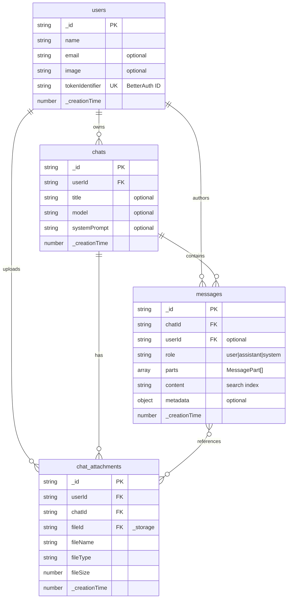

# Database Schema Architecture

## Overview

This document defines the complete database schema for the AI-Accelerated Starter Template, implemented using Convex DB with real-time capabilities and BetterAuth integration for user management.

## Schema Philosophy

- **Real-time First**: All tables support live updates and subscriptions
- **Type Safety**: Complete TypeScript integration with automatic code generation
- **Performance Optimized**: Strategic indexing for query performance
- **Extensible Design**: Schema supports future feature expansion
- **Authentication Integrated**: Seamless BetterAuth user management

## Entity Relationship Diagram



## Complete Schema Definition

```typescript
// Path: convex/schema.ts

import { defineSchema, defineTable } from "convex/server";
import { v } from "convex/values";

// Message Part Type Definitions
const TextPart = v.object({
  type: v.literal("text"),
  text: v.string(),
});

const ImagePart = v.object({
  type: v.literal("image"),
  url: v.string(),
  alt: v.optional(v.string()),
  width: v.optional(v.number()),
  height: v.optional(v.number()),
});

const CodePart = v.object({
  type: v.literal("code"),
  language: v.string(),
  code: v.string(),
  filename: v.optional(v.string()),
});

const FilePart = v.object({
  type: v.literal("file"),
  fileId: v.id("_storage"),
  fileName: v.string(),
  fileType: v.string(),
  fileSize: v.number(),
});

// Union type for all message parts (extensible)
const MessagePart = v.union(TextPart, ImagePart, CodePart, FilePart);

// Metadata objects for different message types
const MessageMetadata = v.object({
  // LLM-specific metadata
  model: v.optional(v.string()),
  tokens: v.optional(v.object({
    prompt: v.number(),
    completion: v.number(),
    total: v.number(),
  })),
  // Processing metadata
  processingTime: v.optional(v.number()),
  temperature: v.optional(v.number()),
  // Error handling
  error: v.optional(v.object({
    code: v.string(),
    message: v.string(),
    timestamp: v.number(),
  })),
  // User interaction metadata
  edited: v.optional(v.boolean()),
  editHistory: v.optional(v.array(v.object({
    timestamp: v.number(),
    previousContent: v.string(),
  }))),
});

export default defineSchema({
  // User accounts managed by BetterAuth
  users: defineTable({
    name: v.string(),
    email: v.optional(v.string()),
    image: v.optional(v.string()),
    tokenIdentifier: v.string(), // Unique ID from BetterAuth provider
    // User preferences
    preferences: v.optional(v.object({
      theme: v.optional(v.union(v.literal("light"), v.literal("dark"), v.literal("system"))),
      language: v.optional(v.string()),
      defaultModel: v.optional(v.string()),
      enableNotifications: v.optional(v.boolean()),
    })),
    // User status
    isActive: v.optional(v.boolean()),
    lastActiveAt: v.optional(v.number()),
  })
  .index("by_token", ["tokenIdentifier"])
  .index("by_email", ["email"])
  .index("by_active", ["isActive", "_creationTime"]),

  // Chat sessions/conversations
  chats: defineTable({
    userId: v.id("users"),
    title: v.optional(v.string()),
    model: v.optional(v.string()),
    systemPrompt: v.optional(v.string()),
    // Chat settings
    settings: v.optional(v.object({
      temperature: v.optional(v.number()),
      maxTokens: v.optional(v.number()),
      topP: v.optional(v.number()),
      frequencyPenalty: v.optional(v.number()),
      presencePenalty: v.optional(v.number()),
    })),
    // Chat metadata
    messageCount: v.optional(v.number()),
    lastMessageAt: v.optional(v.number()),
    isArchived: v.optional(v.boolean()),
    tags: v.optional(v.array(v.string())),
  })
  .index("by_user", ["userId"])
  .index("by_user_active", ["userId", "isArchived", "_creationTime"])
  .index("by_last_message", ["userId", "lastMessageAt"])
  .searchIndex("by_title_content", { 
    searchField: "title", 
    filterFields: ["userId", "isArchived"] 
  }),

  // Individual messages with multi-part content support
  messages: defineTable({
    chatId: v.id("chats"),
    userId: v.optional(v.id("users")), // null for system messages
    role: v.union(v.literal("user"), v.literal("assistant"), v.literal("system")),
    parts: v.optional(v.array(MessagePart)),
    content: v.string(), // Flattened content for search compatibility
    metadata: v.optional(MessageMetadata),
    // Message status
    status: v.optional(v.union(
      v.literal("sending"),
      v.literal("sent"),
      v.literal("delivered"),
      v.literal("error"),
      v.literal("deleted")
    )),
    // Threading support
    parentMessageId: v.optional(v.id("messages")),
    threadLevel: v.optional(v.number()),
  })
  .index("by_chat_created", ["chatId", "_creationTime"])
  .index("by_chat_role", ["chatId", "role", "_creationTime"])
  .index("by_user_created", ["userId", "_creationTime"])
  .index("by_thread", ["parentMessageId", "threadLevel"])
  .searchIndex("by_content", { 
    searchField: "content", 
    filterFields: ["userId", "chatId", "role"] 
  }),

  // File attachments for chat conversations
  chat_attachments: defineTable({
    userId: v.id("users"),
    chatId: v.id("chats"),
    messageId: v.optional(v.id("messages")), // Link to specific message
    fileId: v.id("_storage"), // Convex file storage ID
    fileName: v.string(),
    fileType: v.string(),
    fileSize: v.number(),
    // File metadata
    metadata: v.optional(v.object({
      dimensions: v.optional(v.object({
        width: v.number(),
        height: v.number(),
      })),
      duration: v.optional(v.number()), // For audio/video files
      pages: v.optional(v.number()), // For documents
      encoding: v.optional(v.string()),
    })),
    // Processing status
    status: v.optional(v.union(
      v.literal("uploading"),
      v.literal("processing"),
      v.literal("ready"),
      v.literal("error")
    )),
    // Access control
    isPublic: v.optional(v.boolean()),
    downloadCount: v.optional(v.number()),
  })
  .index("by_chat", ["chatId", "_creationTime"])
  .index("by_user", ["userId", "_creationTime"])
  .index("by_message", ["messageId"])
  .index("by_file_type", ["fileType", "_creationTime"])
  .index("by_status", ["status", "_creationTime"]),

  // User sessions for activity tracking
  user_sessions: defineTable({
    userId: v.id("users"),
    sessionId: v.string(),
    deviceInfo: v.optional(v.object({
      userAgent: v.string(),
      platform: v.string(),
      browser: v.string(),
      ipAddress: v.optional(v.string()),
    })),
    startedAt: v.number(),
    lastActiveAt: v.number(),
    endedAt: v.optional(v.number()),
    isActive: v.boolean(),
  })
  .index("by_user", ["userId", "isActive"])
  .index("by_session", ["sessionId"])
  .index("by_active", ["isActive", "lastActiveAt"]),

  // Chat sharing and collaboration
  chat_shares: defineTable({
    chatId: v.id("chats"),
    ownerId: v.id("users"),
    sharedWithUserId: v.optional(v.id("users")), // null for public shares
    shareToken: v.string(), // Public share token
    permissions: v.object({
      canRead: v.boolean(),
      canWrite: v.boolean(),
      canShare: v.boolean(),
    }),
    expiresAt: v.optional(v.number()),
    isActive: v.boolean(),
    accessCount: v.optional(v.number()),
  })
  .index("by_chat", ["chatId", "isActive"])
  .index("by_owner", ["ownerId", "isActive"])
  .index("by_shared_user", ["sharedWithUserId", "isActive"])
  .index("by_token", ["shareToken"])
  .index("by_expiry", ["expiresAt", "isActive"]),
});
```

## Business Rules and Constraints

### **Data Validation Rules**

#### Users Table
- `name`: Required, 1-100 characters, no special characters except spaces and hyphens
- `email`: Must be valid email format if provided
- `tokenIdentifier`: Must be unique across all users
- `preferences.theme`: Must be one of: "light", "dark", "system"

#### Chats Table
- `title`: If provided, 1-200 characters
- `model`: Must match available LLM model identifiers
- `systemPrompt`: Maximum 2000 characters
- `settings.temperature`: Range 0.0-2.0
- `settings.maxTokens`: Range 1-32000

#### Messages Table
- `content`: Required, maximum 100,000 characters
- `role`: Must be one of: "user", "assistant", "system"
- `parts`: At least one part required if content is empty
- `threadLevel`: Maximum depth of 10 for nested threads

#### Chat Attachments Table
- `fileName`: Required, maximum 255 characters
- `fileSize`: Maximum 100MB (104,857,600 bytes)
- `fileType`: Must be allowed MIME type (see security architecture)

### **Relationship Constraints**

1. **Cascade Deletions**:
   - Delete user → Delete all chats, messages, attachments, sessions, shares
   - Delete chat → Delete all messages and attachments for that chat
   - Delete message → Orphan any child messages (set parentMessageId to null)

2. **Foreign Key Integrity**:
   - All userId references must exist in users table
   - All chatId references must exist in chats table
   - All messageId references must exist in messages table

3. **Business Logic Constraints**:
   - User can only access their own chats unless explicitly shared
   - Messages must belong to an existing chat
   - Attachments must be linked to valid chat and user

## Index Strategy and Performance

### **Query Patterns and Optimization**

#### Primary Access Patterns
1. **User Dashboard**: Get user's recent chats with last message info
2. **Chat History**: Get all messages for a specific chat with pagination
3. **Search**: Full-text search across messages within user's chats
4. **File Management**: Get all attachments for a chat or user

#### Index Usage
```typescript
// Most common queries and their indexes:

// 1. Get user's active chats (by_user_active)
ctx.db.query("chats")
  .withIndex("by_user_active", q => 
    q.eq("userId", userId).eq("isArchived", false)
  )
  .order("desc")

// 2. Get chat messages with pagination (by_chat_created)
ctx.db.query("messages")
  .withIndex("by_chat_created", q => q.eq("chatId", chatId))
  .order("asc")
  .paginate(paginationOpts)

// 3. Search messages across user's chats (by_content search index)
ctx.db.query("messages")
  .withSearchIndex("by_content", q => 
    q.search("content", searchTerm).eq("userId", userId)
  )

// 4. Get chat attachments (by_chat)
ctx.db.query("chat_attachments")
  .withIndex("by_chat", q => q.eq("chatId", chatId))
  .order("desc")
```

### **Performance Considerations**

1. **Pagination**: All list queries use cursor-based pagination
2. **Lazy Loading**: Attachment metadata loaded on demand
3. **Search Optimization**: Content field optimized for full-text search
4. **Cache Strategy**: Frequently accessed data cached at application level

## Migration and Versioning Strategy

### **Schema Evolution Process**

1. **Backward Compatible Changes**: 
   - Add optional fields
   - Add new indexes
   - Add new tables

2. **Breaking Changes**:
   - Remove fields (deprecate first)
   - Change field types
   - Modify relationships

3. **Migration Scripts**:
   - Convex handles schema migrations automatically
   - Data migrations implemented as Convex actions
   - Rollback strategies documented

### **Version Control**
- Schema changes tracked in git
- Migration documentation in `/docs/migrations/`
- Breaking changes require architecture review

## Sample Data Patterns

### **Development Seed Data**
```typescript
// Example user
{
  name: "John Developer",
  email: "john@example.com",
  tokenIdentifier: "auth0|user123",
  preferences: {
    theme: "dark",
    defaultModel: "gpt-4",
    enableNotifications: true
  }
}

// Example chat
{
  userId: "user123",
  title: "Project Planning Discussion",
  model: "gpt-4",
  systemPrompt: "You are a helpful project planning assistant.",
  settings: {
    temperature: 0.7,
    maxTokens: 2000
  }
}

// Example message with multiple parts
{
  chatId: "chat123",
  userId: "user123",
  role: "user",
  parts: [
    { type: "text", text: "Here's my code:" },
    { type: "code", language: "typescript", code: "const x = 1;" },
    { type: "text", text: "What do you think?" }
  ],
  content: "Here's my code: const x = 1; What do you think?"
}
```

This comprehensive schema provides a solid foundation for the AI-accelerated chat application with room for future enhancements and optimizations.
