# AI-Accelerated Starter Template - Architecture Overview

## Introduction

This document outlines the complete fullstack architecture for the AI-Accelerated Starter Template, including backend systems, frontend implementation, and their integration. It serves as the single source of truth for AI-driven development, ensuring consistency across the entire technology stack.

This unified approach combines what would traditionally be separate backend and frontend architecture documents, streamlining the development process for modern fullstack applications where these concerns are increasingly intertwined.

### Starter Template or Existing Project
This project's goal is to create a new, opinionated starter template from scratch. It is not based on a pre-existing public starter like 'Create React App' or 'T3 Stack'. The architecture defined in this document will serve as the blueprint for that new template.

### Change Log
| Date | Version | Description | Author |
| --- | --- | --- | --- |
| July 8, 2025 | 1.0 | Initial draft of the architecture document. | Winston (Architect) |

## High Level Architecture

### Technical Summary

This project utilizes a modern, serverless architecture designed for performance, scalability, and an exceptional developer experience. The frontend is a content-driven Astro application enhanced with interactive React islands. The backend is powered by Convex, which provides a real-time database and serverless functions in a unified platform. This is all deployed on Cloudflare's edge network for global low latency. This architecture directly supports the project's goal of rapid, AI-driven development by providing a pre-configured, low-maintenance, and highly integrated foundation, allowing the developer to focus on application logic and context engineering.

### Platform and Infrastructure Choice

The application will be deployed to the **Cloudflare ecosystem**. The frontend will be served via **Cloudflare Pages**, and any custom server-side logic (like the production log ingestor) will be built and deployed as **Cloudflare Workers**. The Convex backend operates on its own managed infrastructure but integrates seamlessly with this Cloudflare-native environment.

* **Platform:** Cloudflare
* **Key Services:** Pages, Workers, R2 (for future storage needs)
* **Deployment Host and Regions:** Cloudflare's Global Edge Network

### Repository Structure

A **Monorepo** structure is recommended to co-locate the frontend, backend, and shared code, which simplifies dependency management and promotes type-safety across the stack.

* **Structure:** Monorepo
* **Monorepo Tool:** **Turborepo** is recommended for its high-performance task running and simplified dependency management.
* **Package Organization:** The monorepo will contain an `apps` directory for runnable applications (like the Astro web app) and a `packages` directory for shared code (UI components, configs, types).

### High Level Architecture Diagram

```mermaid
graph TD
    subgraph Internet
        User[👩‍💻 User]
    end

    subgraph "Cloudflare Network"
        CDN[Cloudflare Pages/CDN]
        Worker[Cloudflare Worker<br><i>e.g., Logging</i>]
    end

    subgraph "Convex Platform"
        Convex_API[Convex Functions<br><i>Queries, Mutations, Actions</i>]
        Convex_DB[(Convex Database<br><i>Real-time & Persistent</i>)]
    end
    
    subgraph "External Services"
        LLM[LLM Provider<br><i>OpenRouter/Requesty.AI</i>]
        ClaudeSDK[Claude Code SDK]
    end

    User -->|HTTPS Request| CDN
    CDN -->|Serves App| User
    CDN -.->|Client-side API Calls| Convex_API
    CDN -.->|Client-side Logs| Worker
    
    Convex_API --> Convex_DB
    Convex_API -->|External API Calls| LLM
    Convex_API -->|Code Gen Tasks| ClaudeSDK
    
    Worker -->|Forwards Logs| Logflare((Logflare))
```





### Architectural Patterns

* **Serverless Architecture:** By leveraging Convex for the backend and Cloudflare Workers for custom logic, we eliminate the need to manage or provision traditional servers. *Rationale: This provides automatic scaling, reduces operational overhead, and aligns with the project's cost-efficiency goals.*
* **Component-Based UI (Islands Architecture):** Using Astro for static content with interactive "islands" of React. *Rationale: This pattern delivers excellent performance by default (shipping minimal JavaScript) while allowing for rich, dynamic user experiences where needed.*
* **Monorepo:** A single repository for all project code, managed with Turborepo. *Rationale: This simplifies dependency management, enables robust type-sharing between the frontend and backend (Convex), and streamlines the CI/CD process.*
* **API Layer via Backend-as-a-Service (BaaS):** Using Convex as the primary API layer. *Rationale: This drastically reduces the time spent writing boilerplate CRUD APIs and provides powerful real-time capabilities out of the box, directly supporting the "fast feel" requirement.*

---

## **Core System Components**

### **Frontend Architecture**

#### **Astro Application Structure**
```
apps/web/
├── src/
│   ├── components/          # Static Astro components
│   │   ├── Layout.astro     # Base layout component
│   │   ├── Header.astro     # Site header
│   │   └── Footer.astro     # Site footer
│   ├── islands/             # Interactive React components
│   │   ├── ChatInterface.tsx # Main chat UI
│   │   ├── UserProfile.tsx   # User settings
│   │   └── FileUpload.tsx    # File handling
│   ├── pages/               # File-based routing
│   │   ├── index.astro      # Home page
│   │   ├── chat/            # Chat routes
│   │   └── auth/            # Authentication routes
│   └── styles/              # Global styles
```

#### **React Islands Integration**
- **Chat Interface**: Real-time messaging with live updates
- **File Upload**: Drag-and-drop file handling with progress
- **User Profile**: Settings and preferences management
- **Search**: Full-text search across conversations

#### **State Management Strategy**
- **NanoStores**: Lightweight state for cross-island communication
- **Convex Subscriptions**: Real-time data synchronization
- **Local Storage**: User preferences and session data
- **URL State**: Navigation and deep-linking support

### **Backend Architecture**

#### **Convex Function Organization**
```
convex/
├── functions/
│   ├── queries/             # Read operations
│   │   ├── users.ts         # User data retrieval
│   │   ├── chats.ts         # Chat listing and details
│   │   ├── messages.ts      # Message history and search
│   │   └── files.ts         # File metadata queries
│   ├── mutations/           # Write operations
│   │   ├── users.ts         # User management
│   │   ├── chats.ts         # Chat CRUD operations
│   │   ├── messages.ts      # Message sending/editing
│   │   └── files.ts         # File upload handling
│   └── actions/             # External integrations
│       ├── llm.ts           # LLM provider calls
│       ├── auth.ts          # Authentication workflows
│       └── analytics.ts     # Usage tracking
```

#### **Real-time Data Flow**


### **Authentication & Authorization**

#### **BetterAuth Integration**
- **Provider Support**: OAuth providers (Google, GitHub, etc.)
- **Session Management**: Secure token handling
- **User Profiles**: Linked user data in Convex
- **Route Protection**: Middleware-based auth guards

#### **Security Model**
- **Row-Level Security**: Users can only access their own data
- **API Token Validation**: All Convex functions validate authentication
- **CORS Configuration**: Proper cross-origin request handling
- **Rate Limiting**: Protection against abuse

### **File Storage & Management**

#### **Convex File Storage Integration**
- **Direct Upload**: Client-side upload to Convex storage
- **File Processing**: Automatic metadata extraction
- **Access Control**: User-scoped file permissions
- **CDN Distribution**: Global file delivery

#### **Supported File Types**
- **Images**: PNG, JPG, GIF, WebP (with optimization)
- **Documents**: PDF, DOC, TXT (with text extraction)
- **Code Files**: All programming languages
- **Media**: Audio/video files (with metadata)

---

## **External Service Integration**

### **LLM Provider Integration**

#### **OpenRouter/Requesty.AI**
- **Model Selection**: Support for multiple LLM models
- **Streaming Responses**: Real-time message generation
- **Error Handling**: Graceful fallbacks and retries
- **Cost Optimization**: Intelligent model selection based on use case

#### **Message Processing Pipeline**


### **Claude Code SDK Integration**

#### **In-App Code Generation**
- **Code Artifact Creation**: Generate standalone code components
- **Language Support**: Multi-language code generation
- **Template System**: Reusable code templates
- **Version Control**: Track code generation history

#### **Development Workflow Enhancement**
- **Error Analysis**: AI-powered error debugging
- **Code Review**: Automated code quality analysis
- **Refactoring Suggestions**: AI-driven code improvements
- **Documentation Generation**: Automatic code documentation

### **Monitoring & Analytics**

#### **PostHog Integration**
- **User Analytics**: Track user behavior and engagement
- **Feature Flags**: A/B testing and gradual rollouts
- **Funnel Analysis**: Conversion tracking
- **Cohort Analysis**: User retention insights

#### **Sentry Error Tracking**
- **Error Capture**: Comprehensive error monitoring
- **Performance Monitoring**: Application performance tracking
- **Release Tracking**: Associate errors with deployments
- **Alert Configuration**: Real-time notifications

---

## **Core Workflows**

### **New User Onboarding**


### **Chat Message Flow**


### **File Upload & Processing**


---

## **Performance & Scalability**

### **Frontend Performance**

#### **Astro Optimizations**
- **Static Site Generation**: Pre-rendered pages for fast loading
- **Partial Hydration**: Only interactive components load JavaScript
- **Image Optimization**: Automatic image compression and format selection
- **CSS Optimization**: Critical CSS inlining and unused CSS removal

#### **Bundle Optimization**
- **Code Splitting**: Route-based and component-based splitting
- **Tree Shaking**: Remove unused code
- **Compression**: Gzip and Brotli compression
- **CDN Delivery**: Cloudflare edge distribution

### **Backend Scalability**

#### **Convex Scaling**
- **Automatic Scaling**: Functions scale based on demand
- **Database Optimization**: Efficient indexing strategy
- **Connection Pooling**: Optimal database connections
- **Caching Strategy**: Query result caching

#### **Real-time Performance**
- **WebSocket Optimization**: Efficient connection management
- **Subscription Batching**: Reduce unnecessary updates
- **Message Queuing**: Handle high-volume messaging
- **Load Balancing**: Distribute across multiple regions

---

## **Security Architecture**

### **Data Protection**

#### **Encryption Strategy**
- **Data at Rest**: Database encryption with Convex
- **Data in Transit**: TLS 1.3 for all communications
- **File Storage**: Encrypted file storage with access controls
- **API Communications**: Secure token-based authentication

#### **Privacy Controls**
- **Data Minimization**: Collect only necessary user data
- **User Consent**: Clear privacy settings and controls
- **Data Retention**: Configurable data retention policies
- **Export/Delete**: User data portability and deletion

### **Access Control**

#### **Authentication Security**
- **Multi-Factor Authentication**: Optional 2FA support
- **Session Management**: Secure session handling
- **Token Security**: Short-lived tokens with refresh capability
- **Account Recovery**: Secure password reset flows

#### **Authorization Model**
- **Role-Based Access**: User roles and permissions
- **Resource Ownership**: Users can only access their own data
- **API Security**: Function-level authorization checks
- **Audit Logging**: Comprehensive access logging

---

## **Deployment Architecture**

### **Infrastructure Overview**

#### **Cloudflare Ecosystem**


#### **Environment Strategy**
- **Development**: Local development with hot reloading
- **Staging**: Preview deployments for testing
- **Production**: Global edge deployment with monitoring

### **CI/CD Pipeline**

#### **Automated Deployment**


#### **Quality Gates**
- **Automated Testing**: Unit, integration, and E2E tests
- **Security Scanning**: Dependency and code security checks
- **Performance Testing**: Lighthouse CI for performance regression
- **Accessibility Testing**: Automated accessibility validation

---

## **Monitoring & Observability**

### **Application Monitoring**

#### **Error Tracking & Analysis**
- **Sentry Integration**: Comprehensive error tracking
- **Real-time Alerts**: Immediate notification of critical issues
- **Error Aggregation**: Pattern recognition and grouping
- **Performance Monitoring**: Application performance insights

#### **Analytics & Usage**
- **PostHog Analytics**: User behavior and feature usage
- **Conversion Tracking**: User journey analysis
- **A/B Testing**: Feature flag management
- **Custom Events**: Business metric tracking

### **Infrastructure Monitoring**

#### **Performance Metrics**
- **Response Times**: API and page load performance
- **Throughput**: Request volume and capacity
- **Error Rates**: System reliability metrics
- **Resource Usage**: CPU, memory, and storage utilization

#### **Business Metrics**
- **User Engagement**: Daily/monthly active users
- **Feature Adoption**: New feature usage rates
- **Retention Rates**: User retention analysis
- **Revenue Metrics**: Subscription and usage tracking

This comprehensive architecture overview provides the foundation for building a scalable, performant, and maintainable AI-accelerated chat application.
