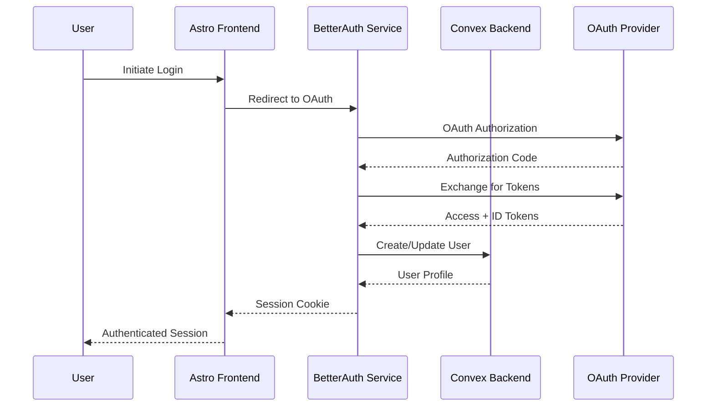

# Security Architecture & Implementation Guide

## Overview

This document defines the comprehensive security architecture for the AI-Accelerated Starter Template, covering authentication, authorization, data protection, input validation, and security monitoring across the entire application stack.

## Security Principles

### **Defense in Depth**
- Multiple layers of security controls
- No single point of failure
- Comprehensive monitoring and alerting

### **Zero Trust Architecture**
- Never trust, always verify
- Least privilege access
- Continuous security validation

### **Privacy by Design**
- Data minimization
- User consent and control
- Transparent data practices

### **Security by Default**
- Secure default configurations
- Fail-safe mechanisms
- Regular security updates

## Authentication Architecture

### **BetterAuth Integration**

#### **Authentication Flow**


#### **BetterAuth Configuration**
```typescript
// auth.config.ts
import { betterAuth } from "better-auth";
import { convexAdapter } from "better-auth/adapters/convex";

export const auth = betterAuth({
  database: convexAdapter({
    // Convex database connection
  }),
  socialProviders: {
    google: {
      clientId: process.env.GOOGLE_CLIENT_ID!,
      clientSecret: process.env.GOOGLE_CLIENT_SECRET!,
    },
    github: {
      clientId: process.env.GITHUB_CLIENT_ID!,
      clientSecret: process.env.GITHUB_CLIENT_SECRET!,
    },
  },
  session: {
    cookieCache: {
      enabled: true,
      maxAge: 60 * 60 * 24 * 7, // 7 days
    },
    freshTokenThreshold: 60 * 60, // 1 hour
  },
  security: {
    csrf: {
      enabled: true,
      secret: process.env.CSRF_SECRET!,
    },
    rateLimit: {
      enabled: true,
      maxAttempts: 5,
      windowMs: 15 * 60 * 1000, // 15 minutes
    },
  },
});
```

### **Token Security**

#### **JWT Token Structure**
```typescript
interface AuthToken {
  sub: string;           // User ID
  iat: number;          // Issued at
  exp: number;          // Expiration
  aud: string;          // Audience
  iss: string;          // Issuer
  tokenIdentifier: string; // Unique identifier for Convex
  scope: string[];      // User permissions
}
```

#### **Token Validation in Convex**
```typescript
// convex/lib/auth.ts
export async function validateAuthToken(ctx: QueryCtx | MutationCtx) {
  const identity = await ctx.auth.getUserIdentity();
  
  if (!identity) {
    throw new SecurityError("No authentication token provided", "AUTH_MISSING");
  }
  
  // Verify token hasn't expired
  if (identity.exp && identity.exp < Date.now() / 1000) {
    throw new SecurityError("Authentication token expired", "AUTH_EXPIRED");
  }
  
  // Get user from database
  const user = await ctx.db
    .query("users")
    .withIndex("by_token", (q) => q.eq("tokenIdentifier", identity.tokenIdentifier))
    .unique();
  
  if (!user) {
    throw new SecurityError("User not found", "USER_NOT_FOUND");
  }
  
  if (!user.isActive) {
    throw new SecurityError("User account disabled", "USER_DISABLED");
  }
  
  return user;
}
```

### **Session Management**

#### **Secure Session Configuration**
```typescript
// Session security settings
export const sessionConfig = {
  // Secure cookie settings
  cookie: {
    name: "auth-session",
    httpOnly: true,           // Prevent XSS
    secure: true,             // HTTPS only
    sameSite: "strict",       // CSRF protection
    domain: process.env.COOKIE_DOMAIN,
    path: "/",
    maxAge: 7 * 24 * 60 * 60 * 1000, // 7 days
  },
  
  // Session rotation
  rotation: {
    enabled: true,
    threshold: 60 * 60 * 1000, // 1 hour
  },
  
  // Concurrent session limits
  concurrentSessions: {
    max: 5,
    strategy: "drop_oldest",
  },
};
```

#### **Session Tracking**
```typescript
// Track user sessions in database
export const trackUserSession = mutation({
  args: {
    sessionId: v.string(),
    deviceInfo: v.object({
      userAgent: v.string(),
      platform: v.string(),
      browser: v.string(),
      ipAddress: v.optional(v.string()),
    }),
  },
  handler: async (ctx, { sessionId, deviceInfo }) => {
    const user = await validateAuthToken(ctx);
    
    // Check for concurrent session limits
    const activeSessions = await ctx.db
      .query("user_sessions")
      .withIndex("by_user", (q) => q.eq("userId", user._id).eq("isActive", true))
      .collect();
    
    if (activeSessions.length >= 5) {
      // Deactivate oldest session
      const oldestSession = activeSessions.sort((a, b) => a.startedAt - b.startedAt)[0];
      await ctx.db.patch(oldestSession._id, { isActive: false, endedAt: Date.now() });
    }
    
    // Create new session record
    await ctx.db.insert("user_sessions", {
      userId: user._id,
      sessionId,
      deviceInfo,
      startedAt: Date.now(),
      lastActiveAt: Date.now(),
      isActive: true,
    });
  },
});
```

## Authorization & Access Control

### **Role-Based Access Control (RBAC)**

#### **User Roles and Permissions**
```typescript
// User role definitions
export enum UserRole {
  USER = "user",
  MODERATOR = "moderator", 
  ADMIN = "admin",
}

export const rolePermissions = {
  [UserRole.USER]: [
    "chat:read",
    "chat:write", 
    "file:upload",
    "profile:read",
    "profile:write",
  ],
  [UserRole.MODERATOR]: [
    ...rolePermissions[UserRole.USER],
    "chat:moderate",
    "user:view",
  ],
  [UserRole.ADMIN]: [
    ...rolePermissions[UserRole.MODERATOR],
    "user:manage",
    "system:configure",
  ],
};
```

#### **Permission Checking**
```typescript
// Permission validation helper
export async function requirePermission(
  ctx: QueryCtx | MutationCtx,
  permission: string
) {
  const user = await validateAuthToken(ctx);
  const userRole = user.role || UserRole.USER;
  const permissions = rolePermissions[userRole];
  
  if (!permissions.includes(permission)) {
    throw new SecurityError(
      `Permission denied: ${permission}`,
      "PERMISSION_DENIED"
    );
  }
  
  return user;
}

// Usage in functions
export const moderateChat = mutation({
  args: { chatId: v.id("chats"), action: v.string() },
  handler: async (ctx, { chatId, action }) => {
    await requirePermission(ctx, "chat:moderate");
    // Moderation logic...
  },
});
```

### **Resource-Level Authorization**

#### **Ownership-Based Access**
```typescript
// Resource ownership validation
export async function validateChatAccess(
  ctx: QueryCtx | MutationCtx,
  chatId: Id<"chats">,
  accessType: "read" | "write" | "delete" = "read"
) {
  const user = await validateAuthToken(ctx);
  const chat = await ctx.db.get(chatId);
  
  if (!chat) {
    throw new SecurityError("Chat not found", "RESOURCE_NOT_FOUND");
  }
  
  // Check ownership
  if (chat.userId !== user._id) {
    // Check if chat is shared with user
    const shareRecord = await ctx.db
      .query("chat_shares")
      .withIndex("by_shared_user", (q) => 
        q.eq("sharedWithUserId", user._id).eq("isActive", true)
      )
      .filter((q) => q.eq(q.field("chatId"), chatId))
      .unique();
    
    if (!shareRecord) {
      throw new SecurityError("Access denied to chat", "ACCESS_DENIED");
    }
    
    // Check specific permissions
    const hasPermission = (() => {
      switch (accessType) {
        case "read": return shareRecord.permissions.canRead;
        case "write": return shareRecord.permissions.canWrite;
        case "delete": return false; // Only owners can delete
        default: return false;
      }
    })();
    
    if (!hasPermission) {
      throw new SecurityError(
        `Insufficient permissions for ${accessType}`,
        "PERMISSION_DENIED"
      );
    }
  }
  
  return { chat, user };
}
```

## Data Protection & Encryption

### **Data Encryption Strategy**

#### **Encryption at Rest**
- **Database**: Convex provides automatic encryption at rest
- **File Storage**: Files encrypted in Convex storage
- **Secrets**: Environment variables encrypted in deployment platform

#### **Encryption in Transit**
```typescript
// HTTPS enforcement middleware
export function enforceHTTPS(req: Request): Response | null {
  const url = new URL(req.url);
  
  // Redirect HTTP to HTTPS in production
  if (process.env.NODE_ENV === "production" && url.protocol === "http:") {
    const httpsUrl = new URL(url);
    httpsUrl.protocol = "https:";
    
    return Response.redirect(httpsUrl.toString(), 301);
  }
  
  return null;
}
```

#### **Sensitive Data Handling**
```typescript
// Sensitive data patterns
export const sensitiveDataRules = {
  // Fields that should never be logged
  noLog: ["password", "token", "secret", "key", "ssn", "creditCard"],
  
  // Fields that should be masked in logs
  mask: ["email", "phone", "name"],
  
  // Fields that require encryption
  encrypt: ["personalData", "paymentInfo", "medicalData"],
};

// Data sanitization for logging
export function sanitizeForLogging(data: any): any {
  if (typeof data !== "object" || data === null) return data;
  
  const sanitized: any = {};
  
  for (const [key, value] of Object.entries(data)) {
    const lowerKey = key.toLowerCase();
    
    if (sensitiveDataRules.noLog.some(pattern => lowerKey.includes(pattern))) {
      continue; // Skip entirely
    }
    
    if (sensitiveDataRules.mask.some(pattern => lowerKey.includes(pattern))) {
      sanitized[key] = typeof value === "string" ? 
        value.replace(/(.{2}).*(.{2})/, "$1****$2") : "[MASKED]";
    } else {
      sanitized[key] = Array.isArray(value) ? 
        value.map(sanitizeForLogging) :
        typeof value === "object" ? sanitizeForLogging(value) : value;
    }
  }
  
  return sanitized;
}
```

### **Privacy Controls**

#### **Data Minimization**
```typescript
// User data collection policy
export const dataCollectionPolicy = {
  required: {
    name: "User identification",
    tokenIdentifier: "Authentication",
  },
  optional: {
    email: "Communication and recovery",
    image: "Profile customization",
    preferences: "User experience customization",
  },
  analytics: {
    usage: "Product improvement",
    errors: "Bug fixing and reliability",
    performance: "Service optimization",
  },
};

// Data retention policy
export const dataRetentionPolicy = {
  userProfiles: "Account lifetime + 30 days",
  chatHistory: "Account lifetime",
  uploadedFiles: "Account lifetime + 7 days",
  analytics: "2 years",
  logs: "30 days",
  sessions: "30 days after logout",
};
```

#### **User Privacy Controls**
```typescript
// Privacy settings management
export const updatePrivacySettings = mutation({
  args: {
    settings: v.object({
      dataCollection: v.optional(v.object({
        analytics: v.boolean(),
        errorReporting: v.boolean(),
        usageStats: v.boolean(),
      })),
      dataSharing: v.optional(v.object({
        allowChatSharing: v.boolean(),
        publicProfile: v.boolean(),
      })),
      dataRetention: v.optional(v.object({
        autoDeleteChats: v.boolean(),
        autoDeleteDays: v.number(),
      })),
    }),
  },
  handler: async (ctx, { settings }) => {
    const user = await validateAuthToken(ctx);
    
    await ctx.db.patch(user._id, {
      privacySettings: settings,
    });
  },
});

// Data export (GDPR compliance)
export const exportUserData = action({
  args: {},
  handler: async (ctx) => {
    const user = await validateAuthToken(ctx);
    
    // Collect all user data
    const userData = {
      profile: user,
      chats: await ctx.runQuery(api.queries.chats.getUserChats, {}),
      messages: await ctx.runQuery(api.queries.messages.getUserMessages, {}),
      files: await ctx.runQuery(api.queries.files.getUserFiles, {}),
    };
    
    // Generate export file
    const exportData = JSON.stringify(userData, null, 2);
    
    // Store temporarily for download
    const storageId = await ctx.storage.store(
      new Blob([exportData], { type: "application/json" })
    );
    
    return storageId;
  },
});
```

## Input Validation & Sanitization

### **Comprehensive Validation Framework**

#### **Input Validation Patterns**
```typescript
// Validation schemas
export const validationSchemas = {
  email: {
    pattern: /^[^\s@]+@[^\s@]+\.[^\s@]+$/,
    maxLength: 254,
    sanitize: (email: string) => email.toLowerCase().trim(),
  },
  
  chatTitle: {
    minLength: 1,
    maxLength: 200,
    pattern: /^[a-zA-Z0-9\s\-_.,!?]+$/,
    sanitize: (title: string) => title.trim().replace(/\s+/g, " "),
  },
  
  messageContent: {
    minLength: 1,
    maxLength: 100000,
    sanitize: (content: string) => content.trim(),
    validate: (content: string) => {
      // Check for potentially harmful content
      const suspiciousPatterns = [
        /<script/i,
        /javascript:/i,
        /data:text\/html/i,
        /vbscript:/i,
      ];
      
      return !suspiciousPatterns.some(pattern => pattern.test(content));
    },
  },
  
  fileName: {
    maxLength: 255,
    pattern: /^[a-zA-Z0-9\s\-_.,()]+\.[a-zA-Z0-9]+$/,
    sanitize: (name: string) => name.replace(/[<>:"/\\|?*]/g, "_"),
  },
};

// Validation helper function
export function validateInput<T>(
  value: any,
  schema: {
    pattern?: RegExp;
    minLength?: number;
    maxLength?: number;
    sanitize?: (value: any) => T;
    validate?: (value: T) => boolean;
  }
): T {
  if (typeof value !== "string") {
    throw new SecurityError("Invalid input type", "VALIDATION_ERROR");
  }
  
  // Sanitize first
  const sanitized = schema.sanitize ? schema.sanitize(value) : value;
  
  // Length validation
  if (schema.minLength && sanitized.length < schema.minLength) {
    throw new SecurityError(
      `Input too short (min: ${schema.minLength})`,
      "VALIDATION_ERROR"
    );
  }
  
  if (schema.maxLength && sanitized.length > schema.maxLength) {
    throw new SecurityError(
      `Input too long (max: ${schema.maxLength})`,
      "VALIDATION_ERROR"
    );
  }
  
  // Pattern validation
  if (schema.pattern && !schema.pattern.test(sanitized)) {
    throw new SecurityError("Invalid input format", "VALIDATION_ERROR");
  }
  
  // Custom validation
  if (schema.validate && !schema.validate(sanitized)) {
    throw new SecurityError("Input validation failed", "VALIDATION_ERROR");
  }
  
  return sanitized;
}
```

#### **File Upload Security**
```typescript
// File upload validation
export const fileUploadSecurity = {
  // Allowed MIME types
  allowedTypes: [
    // Images
    "image/jpeg", "image/png", "image/gif", "image/webp",
    // Documents
    "application/pdf", "text/plain", "text/markdown",
    // Code files
    "text/javascript", "text/css", "application/json",
  ],
  
  // File size limits (in bytes)
  maxFileSize: 100 * 1024 * 1024, // 100MB
  maxTotalSize: 500 * 1024 * 1024, // 500MB per user
  
  // Virus scanning patterns
  suspiciousPatterns: [
    /\.exe$/i, /\.bat$/i, /\.cmd$/i, /\.scr$/i,
    /\.pif$/i, /\.jar$/i, /\.com$/i, /\.vbs$/i,
  ],
  
  // Content validation
  validateFile: async (file: File): Promise<void> => {
    // Check file type
    if (!fileUploadSecurity.allowedTypes.includes(file.type)) {
      throw new SecurityError(
        `File type not allowed: ${file.type}`,
        "FILE_TYPE_NOT_ALLOWED"
      );
    }
    
    // Check file size
    if (file.size > fileUploadSecurity.maxFileSize) {
      throw new SecurityError(
        "File too large",
        "FILE_TOO_LARGE"
      );
    }
    
    // Check file name
    const suspiciousName = fileUploadSecurity.suspiciousPatterns.some(
      pattern => pattern.test(file.name)
    );
    
    if (suspiciousName) {
      throw new SecurityError(
        "Suspicious file name",
        "SUSPICIOUS_FILE"
      );
    }
  },
};
```

## Rate Limiting & DDoS Protection

### **Rate Limiting Strategy**

#### **Multi-Level Rate Limiting**
```typescript
// Rate limiting configuration
export const rateLimits = {
  // Global limits per IP
  global: {
    requests: 1000,
    window: 60 * 60 * 1000, // 1 hour
  },
  
  // Authentication endpoints
  auth: {
    requests: 10,
    window: 15 * 60 * 1000, // 15 minutes
  },
  
  // Message sending
  messages: {
    requests: 100,
    window: 60 * 60 * 1000, // 1 hour
  },
  
  // File uploads
  uploads: {
    requests: 20,
    window: 60 * 60 * 1000, // 1 hour
    size: 100 * 1024 * 1024, // 100MB per hour
  },
  
  // API calls per user
  api: {
    requests: 1000,
    window: 60 * 60 * 1000, // 1 hour
  },
};

// Rate limiting implementation
export async function enforceRateLimit(
  ctx: MutationCtx,
  identifier: string,
  limitType: keyof typeof rateLimits
) {
  const limit = rateLimits[limitType];
  const windowStart = Date.now() - limit.window;
  
  // Count recent requests
  const recentRequests = await ctx.db
    .query("rate_limit_records")
    .withIndex("by_identifier_type", (q) =>
      q.eq("identifier", identifier)
       .eq("limitType", limitType)
       .gte("timestamp", windowStart)
    )
    .collect();
  
  if (recentRequests.length >= limit.requests) {
    throw new SecurityError(
      `Rate limit exceeded for ${limitType}`,
      "RATE_LIMIT_EXCEEDED"
    );
  }
  
  // Record this request
  await ctx.db.insert("rate_limit_records", {
    identifier,
    limitType,
    timestamp: Date.now(),
  });
  
  // Clean up old records (optional optimization)
  const oldRecords = await ctx.db
    .query("rate_limit_records")
    .withIndex("by_timestamp", (q) => q.lt("timestamp", windowStart))
    .take(100);
  
  for (const record of oldRecords) {
    await ctx.db.delete(record._id);
  }
}
```

### **DDoS Protection**

#### **Cloudflare DDoS Protection**
```typescript
// Cloudflare security headers
export const securityHeaders = {
  // Content Security Policy
  "Content-Security-Policy": [
    "default-src 'self'",
    "script-src 'self' 'unsafe-inline' https://apis.google.com",
    "style-src 'self' 'unsafe-inline'",
    "img-src 'self' data: https:",
    "font-src 'self'",
    "connect-src 'self' https://*.convex.dev wss://*.convex.dev",
    "frame-ancestors 'none'",
  ].join("; "),
  
  // Security headers
  "X-Frame-Options": "DENY",
  "X-Content-Type-Options": "nosniff",
  "X-XSS-Protection": "1; mode=block",
  "Referrer-Policy": "strict-origin-when-cross-origin",
  "Permissions-Policy": "camera=(), microphone=(), geolocation=()",
  
  // HTTPS enforcement
  "Strict-Transport-Security": "max-age=31536000; includeSubDomains; preload",
};

// Apply security headers in Astro
export function applySecurityHeaders(response: Response): Response {
  Object.entries(securityHeaders).forEach(([key, value]) => {
    response.headers.set(key, value);
  });
  
  return response;
}
```

## Security Monitoring & Incident Response

### **Security Event Logging**

#### **Audit Logging**
```typescript
// Security event types
export enum SecurityEventType {
  LOGIN_SUCCESS = "login_success",
  LOGIN_FAILURE = "login_failure",
  PERMISSION_DENIED = "permission_denied",
  RATE_LIMIT_EXCEEDED = "rate_limit_exceeded",
  SUSPICIOUS_ACTIVITY = "suspicious_activity",
  DATA_ACCESS = "data_access",
  DATA_MODIFICATION = "data_modification",
  FILE_UPLOAD = "file_upload",
  AUTHENTICATION_ERROR = "auth_error",
}

// Audit log entry
export const logSecurityEvent = mutation({
  args: {
    eventType: v.union(...Object.values(SecurityEventType).map(v.literal)),
    userId: v.optional(v.id("users")),
    ipAddress: v.optional(v.string()),
    userAgent: v.optional(v.string()),
    details: v.optional(v.object({
      resource: v.optional(v.string()),
      action: v.optional(v.string()),
      result: v.optional(v.string()),
      metadata: v.optional(v.any()),
    })),
  },
  handler: async (ctx, args) => {
    await ctx.db.insert("security_events", {
      ...args,
      timestamp: Date.now(),
      severity: determineSeverity(args.eventType),
    });
    
    // Send alerts for high-severity events
    if (determineSeverity(args.eventType) === "high") {
      await sendSecurityAlert(args);
    }
  },
});

function determineSeverity(eventType: SecurityEventType): "low" | "medium" | "high" {
  const highSeverityEvents = [
    SecurityEventType.PERMISSION_DENIED,
    SecurityEventType.SUSPICIOUS_ACTIVITY,
    SecurityEventType.AUTHENTICATION_ERROR,
  ];
  
  return highSeverityEvents.includes(eventType) ? "high" : "medium";
}
```

### **Anomaly Detection**

#### **Behavioral Analysis**
```typescript
// Detect suspicious patterns
export const detectSuspiciousActivity = action({
  args: { userId: v.id("users") },
  handler: async (ctx, { userId }) => {
    const user = await ctx.runQuery(api.queries.users.getUserById, { userId });
    if (!user) return;
    
    const now = Date.now();
    const oneHour = 60 * 60 * 1000;
    
    // Check for suspicious patterns
    const recentEvents = await ctx.runQuery(api.queries.security.getRecentEvents, {
      userId,
      since: now - oneHour,
    });
    
    const suspiciousPatterns = [
      // Too many failed login attempts
      {
        pattern: (events: any[]) => 
          events.filter(e => e.eventType === "login_failure").length > 5,
        reason: "Multiple failed login attempts",
      },
      
      // Rapid-fire requests
      {
        pattern: (events: any[]) => events.length > 500,
        reason: "Excessive request volume",
      },
      
      // Multiple IP addresses
      {
        pattern: (events: any[]) => {
          const ips = new Set(events.map(e => e.ipAddress));
          return ips.size > 5;
        },
        reason: "Multiple IP addresses",
      },
    ];
    
    for (const { pattern, reason } of suspiciousPatterns) {
      if (pattern(recentEvents)) {
        await ctx.runMutation(api.mutations.security.logSecurityEvent, {
          eventType: SecurityEventType.SUSPICIOUS_ACTIVITY,
          userId,
          details: { reason, eventCount: recentEvents.length },
        });
        
        // Consider temporary account restriction
        await ctx.runMutation(api.mutations.users.restrictAccount, {
          userId,
          reason,
          duration: 60 * 60 * 1000, // 1 hour
        });
      }
    }
  },
});
```

### **Incident Response**

#### **Automated Response System**
```typescript
// Incident response automation
export const securityIncidentResponse = {
  // Severity-based response
  responses: {
    low: ["log", "monitor"],
    medium: ["log", "alert", "analyze"],
    high: ["log", "alert", "restrict", "escalate"],
    critical: ["log", "alert", "restrict", "block", "escalate"],
  },
  
  // Response actions
  actions: {
    log: async (incident: SecurityIncident) => {
      await logSecurityEvent({
        eventType: SecurityEventType.SUSPICIOUS_ACTIVITY,
        details: incident,
      });
    },
    
    alert: async (incident: SecurityIncident) => {
      await sendSecurityAlert(incident);
    },
    
    restrict: async (incident: SecurityIncident) => {
      if (incident.userId) {
        await restrictUserAccount(incident.userId, incident.reason);
      }
    },
    
    block: async (incident: SecurityIncident) => {
      if (incident.ipAddress) {
        await blockIPAddress(incident.ipAddress, incident.reason);
      }
    },
    
    escalate: async (incident: SecurityIncident) => {
      await notifySecurityTeam(incident);
    },
  },
};
```

## Security Testing & Validation

### **Security Testing Framework**

#### **Automated Security Tests**
```typescript
// Security test suite
describe("Security Tests", () => {
  test("Authentication bypass protection", async () => {
    const t = convexTest(schema);
    
    // Attempt to access protected resource without auth
    await expect(
      t.query(api.queries.chats.getUserChats, {})
    ).rejects.toThrow("Authentication required");
  });
  
  test("Authorization enforcement", async () => {
    const t = convexTest(schema);
    
    // Create two users
    const user1 = await createTestUser(t, "user1");
    const user2 = await createTestUser(t, "user2");
    
    // User1 creates a chat
    const chatId = await t.mutation(api.mutations.chats.createChat, {
      title: "Private Chat",
    });
    
    // User2 attempts to access User1's chat
    await expect(
      t.query(api.queries.messages.getChatMessages, { chatId })
    ).rejects.toThrow("Access denied");
  });
  
  test("Input validation", async () => {
    const t = convexTest(schema);
    const user = await createTestUser(t, "user");
    
    // Test SQL injection attempt
    await expect(
      t.mutation(api.mutations.chats.createChat, {
        title: "'; DROP TABLE chats; --",
      })
    ).rejects.toThrow("Invalid input format");
  });
  
  test("Rate limiting", async () => {
    const t = convexTest(schema);
    const user = await createTestUser(t, "user");
    
    // Rapid-fire requests should be rate limited
    const promises = Array(20).fill(0).map(() =>
      t.mutation(api.mutations.messages.sendMessage, {
        chatId: "test-chat",
        content: "test message",
      })
    );
    
    const results = await Promise.allSettled(promises);
    const rejected = results.filter(r => r.status === "rejected");
    
    expect(rejected.length).toBeGreaterThan(0);
    expect(rejected[0].reason.message).toContain("Rate limit exceeded");
  });
});
```

## Security Checklist & Compliance

### **Security Implementation Checklist**

#### **Authentication & Authorization**
- [ ] Secure authentication with BetterAuth
- [ ] Multi-factor authentication support
- [ ] Role-based access control (RBAC)
- [ ] Resource-level authorization
- [ ] Session management and rotation
- [ ] Token validation and expiration

#### **Data Protection**
- [ ] Encryption at rest and in transit
- [ ] Sensitive data identification and handling
- [ ] Data minimization practices
- [ ] Privacy controls and user consent
- [ ] Secure data export and deletion
- [ ] GDPR compliance measures

#### **Input Validation & Security**
- [ ] Comprehensive input validation
- [ ] XSS protection and content sanitization
- [ ] SQL injection prevention
- [ ] File upload security controls
- [ ] CSRF protection
- [ ] Content Security Policy (CSP)

#### **Monitoring & Response**
- [ ] Security event logging
- [ ] Anomaly detection
- [ ] Rate limiting and DDoS protection
- [ ] Incident response procedures
- [ ] Security alerting system
- [ ] Regular security assessments

### **Compliance Requirements**

#### **GDPR (General Data Protection Regulation)**
- **Data Processing Lawfulness**: Explicit user consent
- **Data Minimization**: Collect only necessary data
- **Right to Access**: User data export functionality
- **Right to Deletion**: Account and data deletion
- **Data Portability**: Standard export formats
- **Privacy by Design**: Default privacy settings

#### **Security Best Practices**
- **OWASP Top 10**: Protection against common vulnerabilities
- **Zero Trust**: Never trust, always verify
- **Least Privilege**: Minimum necessary permissions
- **Defense in Depth**: Multiple security layers
- **Regular Updates**: Keep dependencies current
- **Security Training**: Team security awareness

This comprehensive security architecture ensures robust protection across all layers of the application while maintaining usability and compliance with privacy regulations.