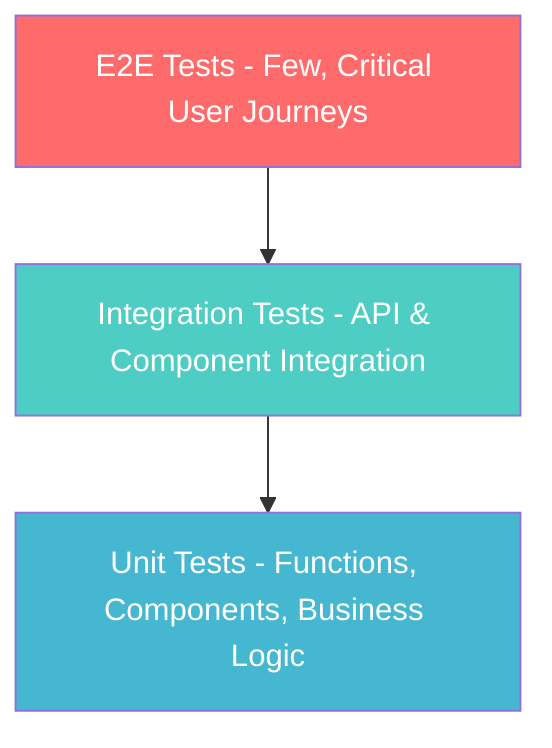

# Testing Strategy & Quality Assurance

## Overview

This document defines the comprehensive testing strategy for the AI-Accelerated Starter Template, emphasizing automated testing, quality assurance, and continuous integration practices across the full stack.

## Testing Philosophy

- **Quality First**: Testing is not an afterthought but integral to development
- **Test-Driven Development**: Write tests alongside code, not after
- **Fast Feedback**: Rapid test execution for immediate developer feedback
- **Comprehensive Coverage**: Balance between speed and thoroughness
- **Real-World Scenarios**: Tests reflect actual user workflows and edge cases

## Testing Pyramid Strategy



### **Test Distribution**
- **70% Unit Tests**: Fast, isolated, comprehensive coverage
- **20% Integration Tests**: API contracts, real-time functionality
- **10% E2E Tests**: Critical user journeys and workflows

## Technology Stack for Testing

### **Frontend Testing**
- **Unit Testing**: Vitest with React Testing Library
- **Component Testing**: Storybook with interaction tests
- **Visual Testing**: Chromatic for visual regression
- **E2E Testing**: Playwright for full browser automation

### **Backend Testing** 
- **Unit Testing**: Vitest for Convex functions
- **Integration Testing**: Convex test environment
- **API Testing**: Generated client testing
- **Performance Testing**: Load testing with Artillery

### **Cross-Stack Testing**
- **Contract Testing**: Ensure frontend-backend compatibility
- **Real-time Testing**: WebSocket connection testing
- **Authentication Testing**: BetterAuth integration testing

## Test Organization Structure

```
project-root/
├── apps/web/
│   ├── src/
│   │   ├── components/
│   │   │   ├── Button.tsx
│   │   │   └── Button.test.tsx        # Co-located unit tests
│   │   ├── islands/
│   │   │   ├── ChatInterface.tsx
│   │   │   └── ChatInterface.test.tsx # Component tests
│   │   └── utils/
│   │       ├── helpers.ts
│   │       └── helpers.test.ts        # Utility tests
│   └── tests/
│       ├── integration/               # Integration tests
│       └── fixtures/                  # Test data
│
├── convex/
│   ├── functions/
│   │   ├── queries/
│   │   │   ├── users.ts
│   │   │   └── users.test.ts          # Backend unit tests
│   │   └── mutations/
│   │       ├── chats.ts
│   │       └── chats.test.ts
│   └── tests/
│       ├── integration/               # Backend integration tests
│       ├── fixtures/                  # Test data
│       └── helpers/                   # Test utilities
│
├── packages/
│   ├── lib/
│   │   ├── src/
│   │   │   ├── utils/
│   │   │   │   ├── validation.ts
│   │   │   │   └── validation.test.ts # Library tests
│   │   └── tests/                     # Package-level tests
│   └── ui/
│       ├── src/components/
│       │   ├── Button.tsx
│       │   └── Button.test.tsx        # UI component tests
│       └── stories/                   # Storybook stories
│
└── e2e/
    ├── tests/
    │   ├── auth.spec.ts               # Authentication flow
    │   ├── chat.spec.ts               # Chat functionality
    │   └── file-upload.spec.ts        # File operations
    ├── fixtures/                      # E2E test data
    ├── page-objects/                  # Page object models
    └── playwright.config.ts           # E2E configuration
```

## Testing Frameworks Configuration

### **Vitest Configuration**
```typescript
// vitest.config.ts
import { defineConfig } from 'vitest/config';
import react from '@vitejs/plugin-react';

export default defineConfig({
  plugins: [react()],
  test: {
    environment: 'jsdom',
    setupFiles: ['./src/test/setup.ts'],
    globals: true,
    coverage: {
      reporter: ['text', 'json', 'html'],
      exclude: [
        'node_modules/',
        'src/test/',
        '**/*.d.ts',
        '**/*.config.*',
      ],
      thresholds: {
        global: {
          branches: 80,
          functions: 80,
          lines: 80,
          statements: 80,
        },
      },
    },
  },
});
```

### **Playwright Configuration**
```typescript
// playwright.config.ts
import { defineConfig, devices } from '@playwright/test';

export default defineConfig({
  testDir: './e2e/tests',
  fullyParallel: true,
  forbidOnly: !!process.env.CI,
  retries: process.env.CI ? 2 : 0,
  workers: process.env.CI ? 1 : undefined,
  reporter: [
    ['html'],
    ['json', { outputFile: 'test-results/results.json' }],
  ],
  use: {
    baseURL: 'http://localhost:3000',
    trace: 'on-first-retry',
    screenshot: 'only-on-failure',
  },
  projects: [
    { name: 'chromium', use: { ...devices['Desktop Chrome'] } },
    { name: 'firefox', use: { ...devices['Desktop Firefox'] } },
    { name: 'webkit', use: { ...devices['Desktop Safari'] } },
    { name: 'Mobile Chrome', use: { ...devices['Pixel 5'] } },
  ],
  webServer: {
    command: 'bun dev',
    url: 'http://localhost:3000',
    reuseExistingServer: !process.env.CI,
  },
});
```

## Testing Categories & Standards

### **Unit Testing Standards**

#### **Frontend Component Tests**
```typescript
// Example: Button.test.tsx
import { render, screen, fireEvent } from '@testing-library/react';
import { describe, it, expect, vi } from 'vitest';
import { Button } from './Button';

describe('Button Component', () => {
  it('renders with correct text', () => {
    render(<Button>Click me</Button>);
    expect(screen.getByText('Click me')).toBeInTheDocument();
  });

  it('calls onClick handler when clicked', () => {
    const handleClick = vi.fn();
    render(<Button onClick={handleClick}>Click me</Button>);
    fireEvent.click(screen.getByText('Click me'));
    expect(handleClick).toHaveBeenCalledTimes(1);
  });

  it('applies correct CSS classes for variants', () => {
    render(<Button variant="primary">Primary</Button>);
    expect(screen.getByRole('button')).toHaveClass('btn-primary');
  });
});
```

#### **Backend Function Tests**
```typescript
// Example: users.test.ts
import { expect, test } from "vitest";
import { convexTest } from "convex-test";
import { api } from "./_generated/api";
import schema from "./schema";

test("creating a user", async () => {
  const t = convexTest(schema);
  
  // Create test user
  const userId = await t.mutation(api.mutations.users.createUser, {
    name: "Test User",
    email: "test@example.com",
    tokenIdentifier: "test123",
  });

  // Verify user creation
  const user = await t.query(api.queries.users.getUserById, { userId });
  expect(user?.name).toBe("Test User");
  expect(user?.email).toBe("test@example.com");
});

test("user authentication flow", async () => {
  const t = convexTest(schema);
  
  // Test user lookup by token
  const user = await t.query(api.queries.users.getCurrentUser, {
    tokenIdentifier: "test123",
  });
  expect(user).toBeNull(); // No user should exist initially
});
```

### **Integration Testing Standards**

#### **API Integration Tests**
```typescript
// Example: chat-integration.test.ts
import { describe, it, expect, beforeEach } from 'vitest';
import { convexTest } from 'convex-test';
import { api } from '../../convex/_generated/api';
import schema from '../../convex/schema';

describe('Chat Integration', () => {
  let t: any;
  let userId: string;

  beforeEach(async () => {
    t = convexTest(schema);
    userId = await t.mutation(api.mutations.users.createUser, {
      name: "Test User",
      tokenIdentifier: "test123",
    });
  });

  it('creates chat and sends message', async () => {
    // Create chat
    const chatId = await t.mutation(api.mutations.chats.createChat, {
      userId,
      title: "Test Chat",
      model: "gpt-4",
    });

    // Send message
    const messageId = await t.mutation(api.mutations.messages.sendMessage, {
      chatId,
      userId,
      role: "user",
      content: "Hello, world!",
    });

    // Verify message
    const messages = await t.query(api.queries.messages.getChatMessages, {
      chatId,
    });
    expect(messages).toHaveLength(1);
    expect(messages[0].content).toBe("Hello, world!");
  });
});
```

#### **Real-time Functionality Tests**
```typescript
// Example: realtime.test.ts
import { describe, it, expect } from 'vitest';
import { setupRealtimeTest } from '../test-utils/realtime-helpers';

describe('Real-time Updates', () => {
  it('broadcasts message updates to all chat participants', async () => {
    const { client1, client2, chatId } = await setupRealtimeTest();
    
    // Client 1 sends message
    await client1.mutation(api.mutations.messages.sendMessage, {
      chatId,
      content: "Real-time test message",
    });

    // Client 2 should receive the update
    const messages = await client2.query(api.queries.messages.getChatMessages, {
      chatId,
    });
    
    expect(messages[messages.length - 1].content).toBe("Real-time test message");
  });
});
```

### **End-to-End Testing Standards**

#### **Critical User Journey Tests**
```typescript
// Example: auth-flow.spec.ts
import { test, expect } from '@playwright/test';

test.describe('Authentication Flow', () => {
  test('user can sign up and create first chat', async ({ page }) => {
    // Navigate to app
    await page.goto('/');
    
    // Click sign up
    await page.click('[data-testid="sign-up-button"]');
    
    // Fill registration form
    await page.fill('[data-testid="name-input"]', 'Test User');
    await page.fill('[data-testid="email-input"]', 'test@example.com');
    await page.click('[data-testid="submit-button"]');
    
    // Should redirect to chat interface
    await expect(page).toHaveURL('/chat');
    
    // Create new chat
    await page.click('[data-testid="new-chat-button"]');
    await page.fill('[data-testid="message-input"]', 'Hello, AI!');
    await page.click('[data-testid="send-button"]');
    
    // Verify message appears
    await expect(page.locator('[data-testid="message"]')).toContainText('Hello, AI!');
  });
});
```

## Test Data Management

### **Test Fixtures Strategy**
```typescript
// test-fixtures/users.ts
export const testUsers = {
  basicUser: {
    name: "John Doe",
    email: "john@example.com",
    tokenIdentifier: "auth0|basic123",
  },
  premiumUser: {
    name: "Jane Smith", 
    email: "jane@example.com",
    tokenIdentifier: "auth0|premium456",
    preferences: {
      theme: "dark",
      defaultModel: "gpt-4",
    },
  },
} as const;

// test-fixtures/chats.ts
export const testChats = {
  basicChat: {
    title: "Test Chat",
    model: "gpt-3.5-turbo",
    systemPrompt: "You are a helpful assistant.",
  },
  codingChat: {
    title: "Code Review",
    model: "gpt-4",
    systemPrompt: "You are a senior software engineer.",
  },
} as const;
```

### **Database Seeding for Tests**
```typescript
// test-utils/seed-database.ts
export async function seedTestDatabase(t: ConvexTest) {
  const users = await Promise.all([
    t.mutation(api.mutations.users.createUser, testUsers.basicUser),
    t.mutation(api.mutations.users.createUser, testUsers.premiumUser),
  ]);

  const chats = await Promise.all([
    t.mutation(api.mutations.chats.createChat, {
      ...testChats.basicChat,
      userId: users[0],
    }),
    t.mutation(api.mutations.chats.createChat, {
      ...testChats.codingChat,
      userId: users[1],
    }),
  ]);

  return { users, chats };
}
```

## Code Coverage Requirements

### **Coverage Thresholds**
- **Overall Project**: 80% minimum coverage
- **Critical Business Logic**: 90% minimum coverage
- **UI Components**: 75% minimum coverage
- **Utility Functions**: 95% minimum coverage

### **Coverage Exclusions**
- Configuration files
- Test files themselves
- Type definition files
- Generated code (Convex types)
- Development-only utilities

### **Coverage Reporting**
```json
// package.json coverage scripts
{
  "scripts": {
    "test:coverage": "vitest run --coverage",
    "test:coverage:ui": "vitest --ui --coverage",
    "test:coverage:report": "vitest run --coverage --reporter=html"
  }
}
```

## Continuous Integration Testing

### **GitHub Actions Workflow**
```yaml
# .github/workflows/test.yml
name: Test Suite

on: [push, pull_request]

jobs:
  test:
    runs-on: ubuntu-latest
    
    steps:
      - uses: actions/checkout@v4
      - uses: oven-sh/setup-bun@v1
      
      - name: Install dependencies
        run: bun install
        
      - name: Run unit tests
        run: bun test
        
      - name: Run integration tests  
        run: bun test:integration
        
      - name: Build project
        run: bun build
        
      - name: Run E2E tests
        run: bun test:e2e
        
      - name: Upload coverage reports
        uses: codecov/codecov-action@v3
        with:
          file: ./coverage/coverage-final.json
```

### **Test Parallelization Strategy**
- **Unit Tests**: Run in parallel across packages
- **Integration Tests**: Sequential to avoid database conflicts
- **E2E Tests**: Parallel across different browsers
- **Performance Tests**: Isolated environment

## Quality Gates & Automation

### **Pre-commit Hooks**
```json
// .husky/pre-commit
#!/usr/bin/env sh
. "$(dirname -- "$0")/_/husky.sh"

bun lint
bun test:unit
bun test:integration
```

### **Pull Request Requirements**
- ✅ All tests pass
- ✅ Code coverage thresholds met
- ✅ No linting errors
- ✅ TypeScript compilation successful
- ✅ E2E tests pass for critical paths

### **Automated Quality Checks**
- **Security Scanning**: Dependabot and CodeQL
- **Performance Regression**: Lighthouse CI
- **Bundle Size**: Size monitoring
- **Accessibility**: Axe-core testing

## Performance Testing Strategy

### **Load Testing**
```typescript
// performance/load-test.ts
import { artillery } from 'artillery';

export const loadTestConfig = {
  target: 'http://localhost:3000',
  phases: [
    { duration: 60, arrivalRate: 10 }, // Warm up
    { duration: 120, arrivalRate: 50 }, // Ramp up
    { duration: 300, arrivalRate: 100 }, // Sustained load
  ],
  scenarios: [
    {
      name: 'Chat messaging',
      weight: 70,
      flow: [
        { post: { url: '/api/auth/login' } },
        { post: { url: '/api/chats' } },
        { post: { url: '/api/messages' } },
      ],
    },
    {
      name: 'File upload',
      weight: 30,
      flow: [
        { post: { url: '/api/auth/login' } },
        { post: { url: '/api/files/upload' } },
      ],
    },
  ],
};
```

## Error Handling & Monitoring

### **Production Error Workflow**
1. **Error Capture**: Sentry captures production errors
2. **Webhook Trigger**: Sentry triggers n8n workflow
3. **Context Gathering**: n8n collects logs from Logflare and analytics from PostHog
4. **Issue Creation**: Automated GitHub issue creation with context
5. **AI Triage**: Triage AI agent analyzes and categorizes issues
6. **Developer Notification**: Team notified based on severity

### **Local Development Workflow**
1. **Error Detection**: Local Bun server endpoint captures errors
2. **Real-time Analysis**: Claude Code SDK analyzes errors
3. **Terminal Output**: Analysis printed directly to developer terminal
4. **Quick Fixes**: Suggested fixes provided immediately

### **Test Environment Monitoring**
- **Test Failure Tracking**: Monitor test reliability and flakiness
- **Performance Regression**: Track test execution time trends
- **Coverage Trends**: Monitor coverage changes over time

## AI-Enhanced Testing

### **Autonomous Test Generation**
- **Coverage Analysis**: AI agent identifies uncovered code paths
- **Test Case Generation**: AI generates tests for edge cases
- **Human Review**: Generated tests submitted for review
- **Integration**: Approved tests integrated into test suite

### **Test Maintenance Automation**
- **Flaky Test Detection**: AI identifies and suggests fixes for flaky tests
- **Test Refactoring**: AI suggests improvements to test structure
- **Mock Updates**: Automated mock updates when APIs change

This comprehensive testing strategy ensures high-quality, reliable software with fast feedback loops and thorough coverage across the entire application stack.
