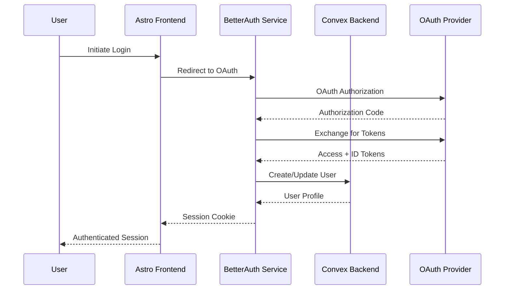

# Story 1.3: Authentication Integration & User Management

**Epic:** 1 - Foundation & Core Setup  
**Story:** 1.3  
**Status:** 📋 READY FOR DEVELOPMENT  
**Assigned:** Dev Agent  

## User Story

**As a** Context Engineer, **I want** a complete authentication system integrated between BetterAuth and Convex with protected routes and user session management, **so that** users can securely sign up, log in, and access personalized chat functionality.

## Acceptance Criteria

1. [ ] BetterAuth is installed and configured with OAuth providers (Google, GitHub)
2. [ ] Authentication flows work end-to-end (signup, login, logout)
3. [ ] Convex backend integrates with BetterAuth for user management
4. [ ] Frontend authentication state management with real-time updates
5. [ ] Protected routes redirect unauthenticated users to login
6. [ ] User session persistence and automatic token refresh
7. [ ] User profile management (view, edit, delete account)
8. [ ] Authentication UI components (login/signup forms, user menu)

## Dev Notes

### Architecture Alignment
This story implements the authentication architecture defined in:
- `docs/architecture/security-architecture.md` - Complete authentication flow and security measures
- `docs/architecture/tech-stack.md` - BetterAuth integration requirements  
- `docs/architecture/database-schema.md` - User and session tables
- `docs/architecture/coding-standards.md` - Development standards and patterns

### Technology Stack Context
- **Authentication:** BetterAuth with Astro integration and OAuth providers
- **Frontend:** Astro with React islands for interactive auth components
- **State Management:** NanoStores for authentication state
- **Backend:** Convex functions for user management (already implemented)
- **Security:** CSRF protection, secure sessions, rate limiting

### Architecture Requirements
Based on the project architecture and security requirements, the authentication system must provide:

#### Authentication Flow


#### Core Components to Implement

1. **BetterAuth Configuration** (`lib/auth/config.ts`)
   - OAuth providers (Google, GitHub)
   - Convex adapter integration
   - Session management
   - Security settings (CSRF, rate limiting)

2. **Authentication API Routes** (`apps/web/src/pages/api/auth/`)
   - `/api/auth/signin` - OAuth initiation
   - `/api/auth/callback` - OAuth callback handling
   - `/api/auth/signout` - Session termination
   - `/api/auth/session` - Session status check

3. **Authentication State Management** (`lib/auth/store.ts`)
   - User session store with NanoStores
   - Authentication status tracking
   - Real-time user data updates
   - Token refresh handling

4. **Authentication UI Components** (`components/auth/`)
   - `LoginForm.tsx` - OAuth login buttons
   - `UserMenu.tsx` - User profile dropdown
   - `AuthGuard.tsx` - Protected route wrapper
   - `AuthProvider.tsx` - Authentication context

5. **Protected Route System** (`lib/auth/guards.ts`)
   - Route protection middleware
   - Authentication redirects
   - Role-based access control
   - Session validation

6. **User Profile Management** (`components/profile/`)
   - `ProfileView.tsx` - Display user profile
   - `ProfileEdit.tsx` - Edit profile form
   - `AccountSettings.tsx` - Account management
   - `DeleteAccount.tsx` - Account deletion

### Technical Implementation Details

#### 1. BetterAuth Installation & Setup
```bash
# Install BetterAuth with required adapters
bun add better-auth @better-auth/convex-adapter
bun add -d @types/better-auth
```

#### 2. OAuth Provider Configuration
- Set up Google OAuth 2.0 credentials
- Configure GitHub OAuth application
- Add environment variables for client IDs and secrets
- Configure redirect URLs for development and production

#### 3. BetterAuth Configuration
```typescript
// lib/auth/config.ts
export const auth = betterAuth({
  database: convexAdapter({
    // Convex database connection
  }),
  socialProviders: {
    google: {
      clientId: process.env.GOOGLE_CLIENT_ID!,
      clientSecret: process.env.GOOGLE_CLIENT_SECRET!,
    },
    github: {
      clientId: process.env.GITHUB_CLIENT_ID!,
      clientSecret: process.env.GITHUB_CLIENT_SECRET!,
    },
  },
  session: {
    cookieCache: {
      enabled: true,
      maxAge: 60 * 60 * 24 * 7, // 7 days
    },
  },
  security: {
    csrf: { enabled: true },
    rateLimit: { enabled: true },
  },
});
```

#### 4. Convex Integration
- Update existing user mutation functions to work with BetterAuth
- Add session management functions
- Implement user profile CRUD operations
- Add authentication middleware for protected functions

#### 5. Frontend Authentication State
```typescript
// lib/auth/store.ts
export const $user = atom<User | null>(null);
export const $isAuthenticated = computed($user, (user) => !!user);
export const $isLoading = atom(false);
```

#### 6. Authentication UI Components
- OAuth login buttons with provider icons
- User profile dropdown menu
- Authentication forms with validation
- Loading states and error handling

#### 7. Route Protection
```typescript
// lib/auth/guards.ts
export const withAuth = (Component: React.ComponentType) => {
  return (props: any) => {
    const user = useStore($user);
    const isAuthenticated = useStore($isAuthenticated);
    
    if (!isAuthenticated) {
      return <Navigate to="/login" />;
    }
    
    return <Component {...props} />;
  };
};
```

### Security Requirements
Following `docs/architecture/security-architecture.md`:

1. **Session Security**
   - HttpOnly cookies for session tokens
   - Secure flag for HTTPS-only transmission
   - SameSite=Strict for CSRF protection
   - Automatic session expiration and refresh

2. **Input Validation**
   - Sanitize all user inputs
   - Validate email formats
   - Protect against XSS attacks
   - Rate limiting on authentication endpoints

3. **Authorization**
   - Role-based access control (RBAC)
   - Resource-level authorization
   - Token validation in Convex functions
   - User ownership verification

4. **Privacy & Compliance**
   - Data minimization principles
   - User consent management
   - GDPR compliance measures
   - Secure data deletion

### Testing Strategy
Following `docs/architecture/testing-strategy.md`:

1. **Unit Tests**
   - Authentication utility functions
   - User state management
   - Form validation logic
   - OAuth callback handling

2. **Integration Tests**
   - End-to-end authentication flow
   - Protected route access
   - Session management
   - User profile operations

3. **E2E Tests**
   - Complete OAuth flow with real providers
   - Multi-tab session synchronization
   - Authentication redirects
   - User profile management

## Tasks

### Task 1: Install & Configure BetterAuth
- [ ] Install BetterAuth with Convex adapter: `bun add better-auth @better-auth/convex-adapter`
- [ ] Create OAuth applications for Google and GitHub
- [ ] Set up environment variables for OAuth credentials
- [ ] Create `lib/auth/config.ts` with BetterAuth configuration
- [ ] Test BetterAuth initialization and provider configuration

### Task 2: Set Up OAuth Providers
- [ ] Configure Google OAuth 2.0 application in Google Cloud Console
- [ ] Configure GitHub OAuth application in GitHub Developer Settings
- [ ] Add client IDs and secrets to environment variables
- [ ] Configure redirect URLs for development and production environments
- [ ] Test OAuth provider connectivity

### Task 3: Create Authentication API Routes
- [ ] Create `apps/web/src/pages/api/auth/[...auth].ts` for BetterAuth endpoints
- [ ] Implement OAuth signin flow with provider selection
- [ ] Add OAuth callback handling with error management
- [ ] Create session management endpoints (check, refresh, destroy)
- [ ] Add CSRF protection and rate limiting
- [ ] Test all authentication endpoints

### Task 4: Update Convex User Functions
- [ ] Modify existing `createUser` mutation to work with BetterAuth tokens
- [ ] Add `getCurrentUser` query with token validation
- [ ] Implement `updateUserProfile` mutation with authentication
- [ ] Add `deleteAccount` mutation with proper cleanup
- [ ] Create authentication middleware for protected functions
- [ ] Test all updated user functions

### Task 5: Implement Frontend Authentication State
- [ ] Create `lib/auth/store.ts` with NanoStores for user state
- [ ] Implement authentication status tracking
- [ ] Add real-time user data synchronization with Convex
- [ ] Create token refresh mechanism
- [ ] Add error handling for authentication failures
- [ ] Test state management with user interactions

### Task 6: Create Authentication UI Components
- [ ] Create `components/auth/LoginForm.tsx` with OAuth buttons
- [ ] Build `components/auth/UserMenu.tsx` with profile dropdown
- [ ] Implement `components/auth/AuthGuard.tsx` for route protection
- [ ] Create `components/auth/AuthProvider.tsx` for context management
- [ ] Add loading states and error handling to all components
- [ ] Style components with TailwindCSS following design system

### Task 7: Implement Protected Route System
- [ ] Create `lib/auth/guards.ts` with route protection utilities
- [ ] Implement authentication middleware for protected pages
- [ ] Add automatic redirects for unauthenticated users
- [ ] Create role-based access control system
- [ ] Add session validation for API calls
- [ ] Test protected route behavior

### Task 8: Build User Profile Management
- [ ] Create `components/profile/ProfileView.tsx` for displaying user info
- [ ] Build `components/profile/ProfileEdit.tsx` with form validation
- [ ] Implement `components/profile/AccountSettings.tsx` for preferences
- [ ] Add `components/profile/DeleteAccount.tsx` with confirmation flow
- [ ] Connect profile components to Convex user functions
- [ ] Test all profile management features

### Task 9: Add Authentication Pages
- [ ] Create `apps/web/src/pages/login.astro` with login form
- [ ] Build `apps/web/src/pages/signup.astro` with signup options
- [ ] Add `apps/web/src/pages/profile.astro` for user profile
- [ ] Create `apps/web/src/pages/settings.astro` for account settings
- [ ] Implement proper page layouts and navigation
- [ ] Add SEO metadata and accessibility features

### Task 10: Security & Error Handling
- [ ] Implement comprehensive input validation
- [ ] Add rate limiting on authentication endpoints
- [ ] Create error boundary components for authentication errors
- [ ] Add security headers for authentication pages
- [ ] Implement session timeout handling
- [ ] Add audit logging for authentication events

### Task 11: Testing & Validation
- [ ] Write unit tests for authentication utilities
- [ ] Create integration tests for authentication flow
- [ ] Add E2E tests for complete user journey
- [ ] Test session management and token refresh
- [ ] Validate security measures and error handling
- [ ] Test OAuth flow with multiple providers

### Task 12: Documentation & Integration
- [ ] Update `README.md` with authentication setup instructions
- [ ] Document OAuth provider configuration steps
- [ ] Create user guide for authentication features
- [ ] Add JSDoc comments to all authentication functions
- [ ] Update architecture documentation with implementation details
- [ ] Verify integration with existing Convex backend

## Definition of Done

- [ ] Users can sign up and log in using Google or GitHub OAuth
- [ ] Authentication state persists across browser sessions
- [ ] Protected routes automatically redirect unauthenticated users
- [ ] User profiles can be viewed, edited, and deleted
- [ ] Session management works with automatic token refresh
- [ ] All authentication flows are secure with proper error handling
- [ ] Authentication UI is responsive and accessible
- [ ] Integration with Convex backend functions properly
- [ ] Comprehensive testing covers all authentication scenarios
- [ ] Documentation is complete and accurate

## File List

### Files to Create:
- `lib/auth/config.ts` - BetterAuth configuration
- `lib/auth/store.ts` - Authentication state management
- `lib/auth/guards.ts` - Route protection utilities
- `lib/auth/types.ts` - Authentication type definitions
- `apps/web/src/pages/api/auth/[...auth].ts` - BetterAuth API endpoints
- `components/auth/LoginForm.tsx` - OAuth login interface
- `components/auth/UserMenu.tsx` - User profile dropdown
- `components/auth/AuthGuard.tsx` - Protected route wrapper
- `components/auth/AuthProvider.tsx` - Authentication context
- `components/profile/ProfileView.tsx` - User profile display
- `components/profile/ProfileEdit.tsx` - Profile editing form
- `components/profile/AccountSettings.tsx` - Account management
- `components/profile/DeleteAccount.tsx` - Account deletion flow
- `apps/web/src/pages/login.astro` - Login page
- `apps/web/src/pages/signup.astro` - Signup page
- `apps/web/src/pages/profile.astro` - Profile page
- `apps/web/src/pages/settings.astro` - Settings page
- `apps/web/src/layouts/AuthLayout.astro` - Layout for auth pages
- `apps/web/src/middleware.ts` - Authentication middleware

### Files to Modify:
- `convex/functions/queries/users.ts` - Add authentication context
- `convex/functions/mutations/users.ts` - Update for BetterAuth integration
- `apps/web/src/layouts/Layout.astro` - Add authentication provider
- `apps/web/src/pages/index.astro` - Add authentication state
- `apps/web/package.json` - Add BetterAuth dependencies
- `apps/web/astro.config.mjs` - Configure authentication middleware
- `.env.example` - Add OAuth environment variables
- `README.md` - Add authentication setup instructions

### Environment Variables to Add:
- `GOOGLE_CLIENT_ID` - Google OAuth client ID
- `GOOGLE_CLIENT_SECRET` - Google OAuth client secret
- `GITHUB_CLIENT_ID` - GitHub OAuth client ID
- `GITHUB_CLIENT_SECRET` - GitHub OAuth client secret
- `BETTER_AUTH_SECRET` - BetterAuth session secret
- `BETTER_AUTH_URL` - Application URL for OAuth callbacks

## Debug Log (for Dev use)
*Development issues and solutions will be documented here*

## Completion Notes (for Dev)
*Implementation details and completion summary will be added here*

## QA Review Notes (if requested)
*Space for QA agent notes if review is requested*

---

**Next Story:** 1.4 - Basic Chat Interface & Real-time Messaging  
**Previous Story:** 1.2 - Core Backend Setup (Convex)  

**Dependencies:** Story 1.2 must be complete  
**Blockers:** OAuth provider setup requires external account configuration